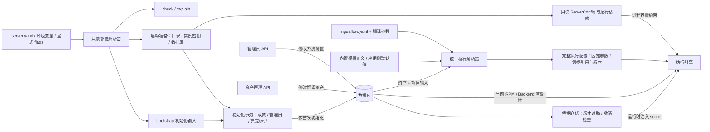

# 配置职责与加载机制整理方案

> 日期：2026-09-30。
> 状态：设计提案，尚未实施。已根据架构评审更新：**独立 `server.yaml` + 环境变量 + 少量启动参数覆盖**，开发期直接调整契约、管理员显式初始化、local 显式开放网络、完整执行快照与独立凭据引用。
> 代码基线：`965f78e4`。本次仅修订设计文档，不修改代码、API 规范或数据库；下文“当前实现”与“目标契约”分别描述现状与拟实施行为。

## 1. 结论与范围

配置来源多并不是主要问题。当前真正缺少的是：每个值由谁管理、在哪个阶段读取、修改后何时生效，以及怎样判断最终使用了哪个值。

推荐按职责拆分，不建立跨文件、环境变量和数据库的全局覆盖链：

1. **部署配置**描述进程如何启动，由部署者维护。`server.yaml`、环境变量和少量 flags 是同一份配置的不同输入，经只读解析和启动依赖准备后，构造只读 `ServerConfig`。
2. **初始化参数**描述首次建站要做什么，单独放在 `bootstrap` 域。它们是创建数据库初始状态的输入，不是长期覆盖数据库的配置。
3. **系统设置**描述平台运行政策，例如是否开放注册，由管理员通过 API 修改，数据库是权威来源。
4. **翻译资产**描述使用哪个模型、提示词、策略和执行计划。Web/local 模式存数据库，CLI 模式使用独立的 `linguaflow.yaml`。两种入口复用领域模型和校验规则，不自动双向同步。
5. **执行配置**是任务创建时解析得到的不可变快照。Worker 使用快照执行；当前容量限制、Backend 有效性、授权和凭据撤销另按明确规则生效。

本方案保留 `serve`、`local`、`translate` 三种模式，不把独立 CLI 改成必须连接服务器的客户端，也不引入配置中心、文件热重载或通用递归 merge 框架。

项目仍处于开发期，直接采用新文档、API 与存储契约，不实现旧格式适配、双 API 表示、弃用窗口或历史数据迁移。后续实施允许显式重建开发数据，但正常启动不能自动清库。文档和快照仍带版本，缺失或不支持的版本明确拒绝；新格式任务自身的暂停、重启恢复是必须保留的能力。



## 2. 当前实现：实际发生了什么

以下依据调用链，而非 YAML tag 或注释推断。

| 入口 / 数据 | 当前加载或更新方式 | 当前生效范围 |
| --- | --- | --- |
| `serve` | `DefaultServerConfig` → 部分环境变量 → 部分 flags | 本次进程；实际上不读 YAML |
| `local` | 服务端默认值与部分环境变量 → local 默认 flags 无条件覆盖 host/port/data-dir；强制 SQLite | 本次本地进程 |
| `translate -c file.yaml` | 读取文件 → 对原始文本展开环境变量 → 从空结构解码 → 部分校验 → flags / 引擎适配 | 本次翻译；不是全量默认配置上的逐字段合并 |
| `translate` 不指定文件 | 直接解析内置 YAML 和内置引用 | 另一条加载路径，未做环境变量展开 |
| `system_settings` | 启动时逐个补齐缺失键；之后 API 写库、注册时读库 | 平台政策；已有值不会被环境变量覆盖 |
| Backend / Profile / Plan / Prompt | 有用户或组织归属的数据库实体；另有内置虚拟策略和提示词 | 新任务或新预览解析时使用 |
| Job 执行快照 | 创建时记录计划、策略及部分模板/参数；若干内置轮次模板与 provider 默认值仍在运行时补入 | 恢复会使用快照，但尚未冻结全部应用侧执行参数 |
| Backend RPM | 数据库存值，修改后刷新本进程的 `LimiterPool` | 已运行任务的后续请求也受当前限制 |
| Backend 删除 | 删库后移除 limiter；已有句柄拒绝后续调用，快照恢复因缺少 limiter 失败 | 已有停止执行语义，但与 limiter 的存在性耦合 |

### 2.1 需要修正的具体问题

| 问题 | 代码证据 | 整理方向 |
| --- | --- | --- |
| 全局 `--config` 可被 `serve/local` 接收，却没有消费 | `internal/cli/root.go:54`、`bootstrap.go:34`、`internal/config/loader.go:18` | 按命令加载正确文档；错误类型明确报错 |
| local 默认 flags 吞掉 host/port/data-dir 环境变量 | `internal/cli/local.go:36`、`:59` | 模式默认值放最低优先级；仅显式 flag 覆盖 |
| workers/pipeline/preview/quick_translate/sse/revision_retention 有消费者，却无外部配置入口 | `internal/config/config.go:277`、`internal/api/server.go:188`、`:231`、`:237` | 纳入部署配置字段清单并接通输入 |
| 数据库环境变量严格解析，其他整数、时长可能失败后静默忽略；无效 bool 变 false | `internal/config/loader.go:66`、`:92`、`:142` | 统一严格解析；缺省与错误分开 |
| CLI 内置默认路径未展开 `${OPENAI_API_KEY}`；显式文件才展开 | `internal/config/cli_config.go:143`、`:159`、`:473` | 内置、文件和外部引用走同一管线 |
| 模板承诺所有字段可被 flags 覆盖，但 log/plugins/output 未接入消费；TM 仅传 Enabled；QA 明确提示 CLI 不支持 | `internal/templates/default/linguaflow.yaml:2`、`internal/cli/translate_run.go:68`、`:156` | 配置契约只列有效能力；废弃或明确拒绝未支持项 |
| `--verbose` 仅在 logLevel 为空时转 debug，而 flag 默认 info | `internal/cli/root.go:36`、`:55` | 用 flag 是否显式设置判断，日志也走最终解析结果 |
| 系统设置允许任意 string 键值，逐项写入非事务；`default_user_role` 被初始化但注册未消费 | `internal/service/admin.go:344`、`internal/service/auth.go:126` | 类型化设置与白名单；移除无效承诺 |
| 注册设置读库失败被解释为允许注册；auto_admin 的设置读取失败也可能放行 | `internal/service/admin.go:413`、`:431` | 政策读取故障返回错误；移除注册自动晋升 |
| 管理员环境变量每次启动都会确保同名用户为 admin，密码仅创建时使用 | `internal/cli/bootstrap.go:184` | 管理员改为显式初始化/维护动作，重启不改变角色 |
| local 请求直接取得本地管理员身份，没有独立的网络开放开关 | `internal/api/server.go:90`、`internal/cli/local.go:36` | 默认限制回环地址；非回环监听要求显式 `--allow-network` |
| `Project.config` 是任意 map，但当前任务创建未读取它 | `internal/service/project.go:410`、`:422`、`internal/service/job.go:466` | 不把它描述成已有的项目执行覆盖层 |
| `NormalizeContext` 会把显式 false / 0 当成缺省覆盖 | `internal/ent/schema/execution_profile_config.go:116`、`internal/service/job.go:880` | 输入 presence 与完整 spec 替代零值猜测 |
| Backend options 中的 API key 被复制进长期任务快照，响应掩码不等于存储隔离 | `internal/service/job.go:823`、`internal/api/handler_job.go:291` | 凭据基础先于新快照落地，新快照直接保存引用与版本 |
| 内置裁决/语义 QA/修订模板及 provider 默认参数仍在执行时选择 | `internal/worker/engine_factory.go:336`、`:360`、`:388`、`internal/backend/google/google.go:326` | 在统一执行解析阶段确定正文与应用侧默认参数 |
| Backend 删除通过移除 limiter 阻止调用与恢复 | `internal/service/backend.go:234`、`internal/worker/engine_factory_telemetry_test.go:86` | 将 Backend 有效性建模为独立实时政策 |

### 2.2 默认策略已经存在格式与数值偏差

`internal/ent/schema/execution_profile_config.go:75` 的默认策略与 `internal/templates/default/profiles/default.yaml` 并不相同：

- Go 默认 Ruby 关闭，保留所有 kinds；YAML 默认 Ruby 开启，只保留 `creative`。
- Go 模型需要 `glossary.bootstrap`；YAML 使用顶层 `bootstrap`。`internal/templates/templates.go:237` 将此 YAML 直接解码到 ent 类型，顶层字段被静默忽略。
- YAML 存在 `repair.partial`、`repair.partial_threshold`，接收结构没有对应字段，同样被忽略。

因此不能简单增加一个配置库，再宣称优先级统一。必须同时统一领域字段、默认值来源和加载路径。

## 3. 字段归属与生效规则

| 类别 | 典型字段 | 权威来源 / 修改者 | 修改何时生效 |
| --- | --- | --- | --- |
| 进程与网络 | host、port、data_dir、serve_ui、CORS、日志、shutdown_timeout | 部署输入 / 部署者 | 重启 |
| 数据库与认证设施 | driver、DSN、连接池、auto_migrate、JWT secret/issuer/TTL | 部署输入 / 部署者；local 可使用持久化实例密钥 | 重启；实例密钥仅在启动准备阶段首次生成 |
| local 网络开放许可 | `--allow-network` | 仅 local 显式启动参数 / 启动者 | 本次进程；只解除非回环限制，不改变 host |
| 进程容量 | worker 数、队列容量、pipeline 准入、RSS、preview/quick_translate 并发与超时、SSE 容量 | 部署输入 / 部署者 | 第一版均重启 |
| 保留政策 | revision_retention | 部署输入 / 部署者 | 重启；不在此次整理中改成管理员热更新 |
| 首次建站 | 初始注册开关、首个管理员初始化参数 | `bootstrap` / 部署者 | 明确的一次性初始化阶段 |
| 系统设置 | registration_enabled | 数据库 / 系统管理员 | 提交后的后续请求 |
| 翻译资产 | Backend、Prompt、ExecutionProfile、ExecutionPlanTemplate | Web/local 的数据库或 CLI 文档 / 资产所有者 | 新执行配置解析时 |
| 项目输入 | source_lang、target_lang、glossary_enabled | 数据库 typed 字段 / 项目有权限者 | 新任务或预览 |
| 单次请求 | 计划选择、目标段落、允许的 segment_filter 覆盖、auto_approve 等 | 请求 / 当前操作者 | 仅该次操作 |
| 任务快照 | 已解析策略、轮次、全部实际模板正文、模型非敏感参数、凭据引用与版本 | 服务端创建任务时生成 | 该任务固定使用；不持有明文 secret |
| Backend 容量政策 | rate_limit_per_minute | 数据库 / Backend 有权限者 | 当前进程后续请求，保留热更新 |
| Backend 有效性 | 是否已删除 | 数据库 / Backend 有权限者 | 删除后拒绝后续调用与恢复 |
| 凭据生命周期 | 当前版本、版本撤销状态 | 凭据仓储 / 凭据有权限者 | 轮换影响新执行；撤销阻止绑定版本的后续调用与恢复 |

以下几个名字相似但含义不同，应在字段说明中写明：

- `workers.translation.count` 是并发任务的执行容量，轮次 `concurrency` 是单任务内部请求并发，两者不能互相代替。
- pipeline 的在途字节和资源数是**每任务**配额；RSS 保险丝是**进程级**约束，不能把前者显示成进程内存硬上限。
- `preview.max_concurrency`、`quick_translate.max_concurrency` 的作用域保持现有定义；即时翻译当前是每 actor 上限，并有派生全局上限。
- 数据库主连接与 CLI 翻译记忆库不是同一资源，不共用 DSN 键。

## 4. 部署配置入口

### 4.1 文件与命令

目标接口如下，**这些新能力尚未实现**：

```text
linguaflow serve --config ./server.yaml
linguaflow local --config ./local.yaml
linguaflow local --host 0.0.0.0 --allow-network
linguaflow translate --config ./linguaflow.yaml -i input.md -o output.md
```

- `serve/local` 使用部署文档，`translate` 使用翻译文档。`server.yaml`、`local.yaml` 是建议文件名，不是必须的名字。
- 文档必须带 `kind` 和 `version`。部署文档为 `kind: server, version: 1`；翻译文档为 `kind: translation, version: 2`。只接受这两种对应契约，不提供旧格式转换或降级读取。
- 模式由子命令确定，不允许文件再指定 `mode` 并反转命令的语义。`local` 有独立模式默认值及限制。
- 文件只通过显式 `--config` 或对应环境变量 `LINGUAFLOW_SERVER_CONFIG` / `LINGUAFLOW_TRANSLATION_CONFIG` 选择；flag 优先。无路径时使用内置默认，不递归查找当前目录、父目录或用户目录。
- 显式路径不存在、kind 错误、版本不支持均报错，不能退回默认。路径选择发生在文件读取前，不受该文件内容影响。
- `linguaflow init` 默认生成新翻译文档，`init --kind server` 生成部署文档；该命令只生成模板，不执行数据库初始化。完整生成引用文件，禁止生成一个立即因缺文件而不可用的模板。
- 部署文档与翻译文档不能混用；错误 kind 或版本必须明确失败。

### 4.2 优先级只适用于部署字段

```text
模式默认值 < server.yaml 中显式提供的值 < 支持的环境变量 < 显式设置的 flags
```

“显式”必须由 presence 表达：Cobra 使用 `Changed`；输入 DTO 使用指针或可选值包装。不要用 `value != 0`、`value != ""` 判断是否设置。

flags 收敛为：`--config`、`--host`、`--port`、`--data-dir`、`--auto-migrate`、`--no-ui`、日志选项，以及 local 专用的 `--no-browser`、`--allow-network`。JWT secret 通过环境变量或文件提供，CORS 通过部署文件或环境变量配置；不保留 `--jwt-secret`、`--cors-origins` 作为过渡入口。高级参数不逐个增加 flags。

每个公开部署字段都必须有文件入口；环境变量通过显式字段表映射，列出 key、类型、适用模式、默认值、敏感性和生效时机。有效字段继续使用 `LINGUAFLOW_HOST`、`LINGUAFLOW_DATABASE_DSN` 等命名，新字段沿用当前前缀规则，不增加重复别名。`--allow-network` 是命令级许可，不属于部署文档字段，不提供 YAML 或环境变量映射。

不根据反射扫描任意字段并自动开放环境变量，也不自动读取 `.env`。部署工具自行注入环境变量。

### 4.3 只读解析与启动准备

1. 确定命令、模式、配置路径和显式 flags；保存本次环境变量输入。
2. 读取文档，检查 kind 与版本；缺失或不支持的版本明确拒绝。
3. 按 typed schema 解码，拒绝未知字段、重复键和错误类型。保留“未提供”和“显式为空 / false / 0 / []”的区别。
4. 在允许的字符串字段解析变量或文件引用。禁止对整段原始 YAML 文本先替换，以免值中的冒号、换行等改变结构。
5. 合并文件、环境变量和显式 flags；填充仍缺失的模式默认值及派生默认值。
6. 进行输入语义校验，输出只读解析结果、bootstrap 输入、字段来源及待准备的依赖。local 未指定 secret 且实例密钥文件不存在时，记录“启动时生成”，不在解析阶段创建文件。

上述步骤是 `serve/local` 与 `config check/explain` 共用的只读路径，允许读取已有文件，不创建目录、生成密钥、打开业务数据库或绑定端口。解析结果可含“使用持久化实例密钥”这样的依赖描述，不能把待生成占位符作为真实 secret 传给业务服务。

只有启动命令继续执行启动准备：初始化正式 logger，创建目录，读取或首次生成并持久化 local 实例密钥，打开数据库，执行所需 schema 准备及第 5 节的初始化事务，再装配服务与监听器。依赖准备完成后构造新的只读 `ServerConfig` 与运行依赖，不就地修改解析结果；监听得到的实际地址与端口属于独立运行状态。

解析/类型错误即使位于被覆盖的来源中也报告；最终值的范围和跨字段关系在合并后校验。默认填充、规范化、校验分开，校验函数不得偷偷改值。

数据库默认连接池依赖**最终 driver**；队列容量默认值依赖**最终 worker 数**；SSE 回放默认值依赖**最终 ring 容量**。这些值只在缺省时派生，不能因为默认值已预填而阻止派生，也不能覆盖用户显式值。

### 4.4 值与路径约定

- `false`、`0`、空数组可有合法含义，按字段 schema 决定。例如 local `port: 0`、`rss_limit_mb: 0` 和数据库 `max_open_conns: 0` 都有明确意义。
- 初期文件中的 `null` 统一拒绝；需要“恢复默认”时删除该字段。数据库/API 的 nullable 或 PATCH 清除语义另按对应契约处理，不与部署文件共用隐式规则。
- 未提供用默认；显式非法值报错。空 CORS 列表表示不允许跨域，不自动恢复为 `*`；local 的同源访问与网络开放许可另按模式规则处理。
- duration 使用 `30s`、`5m` 形式。不得混用裸数字秒与纳秒；有单位的整数使用明确后缀，如 `_mb`。
- YAML bool 使用 `true/false`；环境变量布尔值接受 `true/false/1/0/yes/no`，其他词报错，不把拼写错误解释为 false。
- 硬限制和默认值分开。例如 quick_translate 超过绝对并发/超时上限直接报错，不静默钳制或回退。
- 文件中路径相对该文件所在目录；flags 和环境变量中普通路径相对启动工作目录；派生路径相对已解析的 data_dir。来源信息记录采用了哪个基准。
- DSN 是驱动连接串，不套用通用路径重写。SQLite 空 DSN 由 data_dir 派生；自定义 SQLite 文件 DSN 要求绝对文件路径，相对文件 DSN 报错。
- CLI profile/prompt 外部引用继续限制在配置目录内；按真实解析路径检查，保留目录逃逸防护。模板正文默认作为正文，不对提示词中的 `${...}` 做环境变量展开。

### 4.5 环境变量引用与敏感字段

部署环境变量覆盖与文件中的 `${NAME}` 引用是两种机制，帮助文案分别说明。

- 对允许引用的字符串字段，`${NAME}` 缺失时报字段错误；`${NAME:-fallback}` 在缺失或空值时使用 fallback。显式空值能否接受仍由字段 schema 决定。
- 部署文档和翻译文档采用相同的严格引用语义；内置翻译默认文档也走此路径，不另设宽松解析入口。
- 初期只为确有需要的敏感字段支持环境变量文件形式，例如 `LINGUAFLOW_JWT_SECRET_FILE`、`LINGUAFLOW_DATABASE_DSN_FILE`。同一层同时给直接值与 `_FILE` 报冲突；上层显式来源覆盖下层来源。
- `_FILE` 指向的文件读取与空内容错误必须带字段名，不输出文件内容；移除一个末尾换行，不任意 trim 密钥正文。
- 配置诊断、日志和错误不得输出 JWT secret、含凭据的 DSN、初始化密码和 provider key；只输出是否已配置、来源类型和安全标识。
- serve 必须显式提供有效 JWT secret，缺失时解析失败。local 未显式配置时使用 data_dir 下的持久化实例密钥：已有文件只读加载；文件缺失在离线检查中显示“启动时生成”，仅启动准备阶段生成并原子持久化，重启复用；文件损坏或不可读直接报错，不静默重新生成。并发启动不得互相覆盖已生成密钥。

### 4.6 local 的明确差异

local 默认 `127.0.0.1:18080`，data_dir 默认 `UserConfigDir/LinguaFlow`；双击启动复用相同解析器。

- host/port/data-dir 的模式默认值不覆盖显式环境变量，但最终 host 必须通过 local 网络边界校验。
- 默认仅允许回环地址（含 `127.0.0.1`、`::1`；`localhost` 绑定时也必须落在回环地址）。来自文件、环境变量或 `--host` 的非回环地址、通配监听地址均拒绝，不能因优先级较高而绕过限制。
- 只有 local 命令显式传入 `--allow-network=true` 才允许非回环监听；默认或显式 false 均不允许。该参数没有文件/环境变量入口，也不自动把 host 改为 `0.0.0.0`。`serve` 不接受此参数。
- local 仍是免登录单用户模式。帮助文案、启动日志与诊断必须说明：开放网络后，能够连接的客户端拥有本地管理员权限；该参数不启用认证，CORS 也不代替访问控制。双击启动没有此显式许可，遵循同一回环限制。
- local 继续使用其 data_dir 下的 SQLite。服务端专用 `LINGUAFLOW_DATABASE_*` 不参与 local 解析，诊断明确显示不适用；不因继承了 PostgreSQL 部署环境而改变本地数据库。
- local 文件中显式提供不支持的数据库选择/连接项应报错，不静默换回 SQLite。数据库字段的适用模式写进字段表。
- 保留 local 的端口冲突顺延行为，但仅启动阶段实际尝试绑定，不在离线解析时探测端口。“请求端口”与“实际绑定端口”分开，后者是运行状态，不回写不可变配置。`port: 0` 交给 OS 分配；浏览器地址和依赖实际端口的同源规则使用运行状态。

### 4.7 部署文件示例

下列为建议的新契约，省略字段使用模式默认；**不能直接交给当前二进制**：

```yaml
kind: server
version: 1
server:
  host: 0.0.0.0
  port: 8080
  data_dir: ./data
  auto_migrate: true
  serve_ui: true
  database:
    driver: sqlite
  workers:
    translation:
      count: 4
      queue_capacity: 16
    sync:
      count: 2
      queue_capacity: 16
  pipeline:
    max_inflight_weight_mb: 32
    max_inflight_resources: 8
    rss_limit_mb: 0
  preview:
    max_concurrency: 2
    timeout: 5m
    apply_token_ttl: 15m
log:
  level: info
  format: json
bootstrap:
  registration_enabled: false
  admin:
    username: admin
    email: admin@example.com
    password: ${LINGUAFLOW_BOOTSTRAP_ADMIN_PASSWORD}
```

首次 serve 使用本例时，需提供示例中的管理员密码环境变量，以及 `LINGUAFLOW_JWT_SECRET` 或对应 `_FILE`。`${LINGUAFLOW_BOOTSTRAP_ADMIN_PASSWORD}` 是文件中的变量引用，不表示该变量会在业务服务内部被再次读取；初始化完成后可删除 `bootstrap.admin` 输入及其密码引用，避免重启继续依赖初始化凭据。`log` 归部署配置，`bootstrap` 单独传给初始化流程，不保留在运行期 `ServerConfig.Registration` 中。

## 5. 系统设置与初始化

### 5.1 运行期数据库单独负责

新增专门的 SettingsService。保留 `system_settings` 表作为存储，实现类型化服务接口；本轮唯一的运行期设置是 `registration_enabled: boolean`。移除 `auto_admin`、`default_user_role` 及其环境变量入口，不保留只读废弃字段或旧字符串表示。公开注册创建的用户固定为普通用户，不根据当前管理员数量决定角色。

保留 `/admin/settings` 的资源位置，先在 OpenAPI 定义布尔值请求/响应，拒绝未知字段及字符串替代值。更新先完整校验，再事务提交，并记录操作者与非敏感变更。前端设置页与生成类型配套改为布尔控件及新请求，后端不为旧页面维持第二套契约。

注册读取数据库权威值，不回退到文件或当前环境变量。区分未初始化、已初始化但设置缺失/非法、读库故障；初始化失败或状态损坏阻止服务进入就绪状态，运行期政策读取失败返回服务不可用，不自动开放注册。

### 5.2 初始化是动作，不是长期覆盖

`bootstrap` 是一次性初始化输入，包含初始 `registration_enabled` 和 serve 的 `admin`（username、email、password）。初始注册默认关闭；管理员密码必须通过合法输入提供，不生成固定默认密码。允许敏感字符串使用第 4 节的变量引用规则。

首次初始化在数据库级并发保护下，以同一事务写入初始政策、指定管理员及初始化完成标记（含版本和实例模式）；任一步失败全部回滚，不留下部分设置、孤立管理员或提前写入的完成标记。密码先校验并计算哈希，再在事务内存储；明文不写入标记或日志。并发启动只允许一个初始化事务成功，其余读取已提交状态，不再次应用自己的 bootstrap 输入。

serve 未初始化且缺少管理员输入时，启动准备失败、不进入就绪状态，提示补齐 bootstrap 或运行独立的管理员初始化维护命令。离线检查不连接数据库，因此可以报告“未初始化的 serve 实例需要管理员输入”，不能据此推断当前实例一定缺少管理员。

local 保留自动创建的内置本地身份，它属于单用户模式初始化，不属于公开注册自动晋升；本地身份、初始政策与模式完成标记同样事务提交。local 不消费 serve 的 `bootstrap.admin`，显式提供时报告不适用。初始化标记约束实例模式，不能把 local 内置身份当成 serve 的显式管理员；开发期切换模式使用独立数据目录或显式重建数据。

新契约的正常启动只验证已经完成的初始化状态，不重新补种、晋升用户或重设密码。删除全部管理员也不会重新开放认领，不把“没有管理员”解释为“从未初始化”。有业务数据却没有合法完成标记的数据库报告状态不完整，不自动按空库初始化；本轮不负责识别或迁移改造前的数据库。

管理员维护使用独立的 `admin` 命令组：首次初始化复用上述完整事务，已初始化实例的管理员创建或恢复则是显式维护动作，不重跑 bootstrap 或覆盖注册政策。命令复用部署解析、数据库连接与维护访问约束，可在 HTTP 服务尚未就绪时运行；它与仅生成文件的 `linguaflow init` 分离。启动路径不保留独立读取管理员环境变量并确保角色的旁路。

数据库 schema 准备先于初始化事务；`auto_migrate=false` 表示不自动变更 schema，需要预先准备新 schema，不表示跳过显式的一次性数据初始化。未来新增持久化设置通过明确的 schema/数据演进处理，不借每次启动读取 bootstrap 持续补种；这不引入本次改造前历史数据的迁移义务。

## 6. 翻译配置：两种存储，一个领域模型

### 6.1 复用的是含义和校验

Web/local 的 Backend、Profile、Prompt、Plan 保留用户/组织所有权及现有授权规则。CLI 的同类对象使用文档内名称引用；Web 使用数据库 ID 或内置引用，由适配层解析。

不让服务启动时自动把 CLI YAML 灌进数据库，也不在读库失败时回退到 YAML。未来如需导入/导出，应是显式操作，带目标所有者、冲突策略、版本和预览；不属于本轮基础整理的前置条件。

领域类型应独立于 ent、OpenAPI DTO、Cobra 和环境变量，例如 `ProfileSpec`、`PlanSpec`、`BackendSpec`、`ResolvedExecutionSpec`。不同入口先完成输入适配、授权和资产查询，再交给共享解析器；engine 只接收已解析的执行参数与运行依赖。数据库访问、文件读取、凭据解密不能藏进领域默认值或校验函数。

CLI 暂未实现的轮次和功能使用显式能力检查。共用模型不意味着当前 CLI 自动支持 Web 的全部 `adjudicate/semantic_qa/correct` 等轮次。

### 6.2 默认值只有一个定义位置

- 部署默认值在配置包的纯函数中定义；翻译领域默认值在领域包中定义。
- 内置策略、初始化样例和默认 CLI 文档基于同一领域默认值生成或校验；内置模板正文仍使用嵌入文件，但仅在解析新执行配置时读取并复制进 spec，不在任务执行或恢复时重新选择。
- ent schema 的默认值只表达持久化完整性要求，不再拥有另一套翻译语义默认值。OpenAPI 的 default 作为契约说明，与领域值做一致性验证。
- 输入 DTO 保留字段 presence；完成默认填充后生成完整不可变 spec。对完整 spec 不再执行“如果 false 就改 true”一类补全。
- 未命中的显式 profile/prompt/backend 引用报错。只有未指定且契约允许默认的引用才使用默认对象。
- 外部文件与内联内容二选一，冲突报错；不以“某几个字段非零”猜测是否有内联配置。
- 普通对象按字段的显式 presence 合并；数组作为整体替换；命名资产按明确 key 管理，不隐式将两个同名 Profile 深度叠加。请求仅能覆盖契约列出的字段。

新格式的默认策略以对用户展示的内置 YAML 意图为基准：Ruby 开启、仅保留 creative；术语内联 bootstrap 关闭但保留参数；QA 关闭。先修正字段结构与无效字段，再固定为一个带版本的默认集。术语内联 bootstrap 属于翻译领域，与部署文档顶层的一次性建站 bootstrap 无关。后续修改默认集仅影响新解析的执行，新格式任务恢复不重新补默认值。

CLI 的 log 应接到 logger；output/plugins/TM 未接入的能力不能继续假装有效。P0 列清有效字段和入口能力，新契约对不支持的非默认配置明确拒绝，模板不展示无效选项；功能是否补齐另立实现任务，不在配置重构中顺手扩大范围。

### 6.3 执行解析不是通用覆盖栈

现有规则应保留并收拢到一个解析入口：

| 输入 | 解析规则 |
| --- | --- |
| 普通 Job | 项目 typed 语言与术语开关 + 明确选择的 Plan；有 extract 轮时强制启用 glossary |
| 计划级策略 | `Plan.profile_id` 选中完整 Profile；不从多个全局配置逐层拼接 |
| 轮次 | 解析引用的 Backend/Prompt 或该轮次的内置模板，确定实际正文、应用侧模型参数及该轮次批量、并发、重试参数 |
| segment_filter | 请求提供的合法覆盖值 > 轮次配置 > `pending_only` |
| auto_approve | 来自此次请求，写入此次快照 |
| 即时翻译语言 | 请求 > 项目 > `auto/zh`；保持即时翻译现有契约 |
| 即时翻译术语 | 项目术语开关为基底；有 extract 轮或请求内联 glossary 时强制启用；临时新增术语不回写项目 |
| CLI 语言 | 显式 `--from/--to` > CLI 文档 > 领域默认；在生成 spec 前完成，QA 等组件看见同一个语言值 |

`Project.config` 不进入执行解析器，不新增任意 map 的通用覆盖层。项目执行输入只取契约列出的 typed 字段；该扩展字段若保留，必须注明不影响执行。是否删除其 CRUD 接口属于独立 API 清理，不以兼容保留或数据迁移作为本轮配置整理的前置任务。

### 6.4 快照与实时政策

统一生成带 `schema_version`、默认集版本、资产来源 ID/版本或摘要的 `ResolvedExecutionSpec`：任务创建后持久化；预览/即时翻译/CLI 使用同结构的内存实例，不要求都落库。格式缺失或版本不支持时拒绝执行，不用新默认值猜测读取。新快照从首次引入就只保存凭据引用与版本，依赖第 7 节已经可用的凭据基础。

冻结范围包括语言、完整策略、计划轮次、所有实际模板正文、模型和影响结果的非敏感参数、凭据绑定。解析器必须覆盖 translate/extract 等资产模板，以及裁决、语义 QA、修订、Ruby 重试使用的内置或引用模板和参数。provider 在应用代码中补入的默认值（如 max_tokens）也在解析时确定；故意交给远端模型决定的未指定参数保留其明确语义，不承诺冻结远端服务的行为。

默认集版本和来源摘要用于解释，不替代实际值。编辑资产、升级内置模板或调整应用侧 provider 默认值只影响新解析的执行配置；新格式任务暂停恢复、重启恢复均使用已保存的完整 spec。EngineFactory/provider 装配只创建运行依赖及转换固定参数，不再为完整 spec 选择模板或补入会改变执行结果的默认值。

实时政策单独处理：

| 政策 | 运行规则 |
| --- | --- |
| 进程容量 | 使用本进程生效的部署配置，不由历史快照覆盖 |
| Backend RPM | 数据库当前政策加本进程 limiter，快照值不控制限流 |
| Backend 有效性 | 删除后禁止后续调用与任务恢复，不因快照完整或凭据仍有效而继续 |
| 凭据版本状态 | 固定读取快照绑定版本；该版本被撤销后拒绝后续调用与恢复，不切换为当前版本 |

Backend 有效性与凭据撤销分别检查、分别报告原因，不能再依靠 limiter 是否存在代替业务政策。检查覆盖排队等待结束、后续重试及恢复后发出的请求；不承诺撤回删除/撤销前已经发出的上游请求。凭据轮换、Backend 删除和凭据撤销是不同事件，详见第 7 节。

授权需要区分操作主体：API 查询、控制、订阅和新执行继续按当前权限检查；已经接受的组织任务不因创建者后来退组而自动取消，在 Backend 和凭据仍有效时继续使用原快照。保留 `internal/service/job_authorization.go` 与 `organization_execution_test.go` 的授权边界；成员身份变化不等于凭据撤销或 Backend 删除。

本轮实时刷新限定于单进程，不宣称支持多实例即时同步。将来部署多实例时再针对这些政策设计刷新/通知与全局配额；本次不引入分布式配置中心。

## 7. 凭据单独建模

凭据基础可以在部署加载器之后独立建设，但必须先于共享执行模型与新快照集成；轮换管理和版本回收等生命周期完善另设后续阶段。不能先发布包含明文 secret 的新快照，再等待后续阶段更换结构。

- 部署 secret（JWT、数据库连接凭据）属于部署输入；用户/组织 provider key 属于有所有权的凭据对象。
- Backend 的普通 options 保存 model、endpoint、生成参数等；secret 通过独立写入字段管理，读取返回 `has_secret` 或凭据标识。不要向客户端返回真实 secret 以供“原样保存”。
- 新执行快照保存凭据引用与版本，不包含明文；凭据仓储提供创建/存储、按引用与版本受控读取及状态检查，能够实际支持请求和恢复。运行时注入客户端的 HTTPClient 等依赖也不序列化进快照。
- 任务必须绑定凭据版本；新任务绑定创建时的当前版本。轮换创建新版本，不改写已有版本；引用任务仍可执行或恢复期间，保留其绑定版本。撤销则阻止使用该版本的后续请求与恢复。若要用新凭据重跑，显式创建新执行，不改写历史快照或静默切换身份。
- provider endpoint 与凭据绑定一起校验；快照不得把注入的凭据发送到绑定范围外的 endpoint。
- CLI 使用本次进程内的凭据注册表，将文件/环境变量取得的 secret 与内存 spec 分离；引用和版本在该次执行内稳定，不要求连接服务端数据库，也不承诺跨 CLI 进程恢复这些临时引用。
- 持久化 secret 若做加密，主密钥来自部署侧，带 key ID 与轮换方案；不把“增加加密字段”当作完整生命周期设计。

Backend 删除仅使该 Backend 不再可执行，不自动撤销可能由其他 Backend 使用的凭据版本；凭据撤销影响所有绑定该版本的执行。即使被删除 Backend 的凭据版本仍保留，该 Backend 的任务也不能恢复。两个判断独立于 RPM 和 limiter 注册状态。

新快照及 Ruby 重试等所有嵌套 Backend 配置都必须满足“无明文、引用可解析”的同一规则。凭据基础阶段就提供版本绑定、可用状态及运行检查，后续阶段完善轮换/撤销管理入口和引用任务结束后的版本回收，不延后新快照所必需的读取链路。本轮不实现改造前明文快照的转换；开发数据通过显式重建进入新契约。

## 8. 可诊断性与模块组织

### 8.1 让最终值可解释

新增以下只读诊断命令：

```text
linguaflow config check --mode serve --config ./server.yaml
linguaflow config explain --mode serve --config ./server.yaml
linguaflow config explain --mode local --config ./local.yaml
```

`check` 做本地解析、默认填充、引用和输入语义校验，只读取所需文件，不创建目录、生成或改写密钥、不连接业务数据库、不执行 bootstrap、不探测或绑定端口、不调用模型服务。`explain` 使用相同解析结果输出字段、脱敏值、来源、适用模式和生效时机；待准备依赖显示为状态，不伪装成已经可用的运行值。

诊断复用所选模式的显式覆盖与限制；`--mode local` 时可用同名 `--allow-network` 参数模拟 local 启动输入，但不启动服务或持久化许可。实际 local 启动仍须自己显式携带该参数。非回环 host 且缺少许可时，check/explain 和启动解析一致失败。

serve 的解释输出示例（端口显式覆盖为 18080）：

| key | 有效值 | 来源 | 生效 |
| --- | --- | --- | --- |
| server.port | 18080（请求端口） | flag: --port | 重启 |
| server.workers.translation.count | 4 | server.yaml | 重启 |
| server.jwt_secret | 已配置，已脱敏 | env: LINGUAFLOW_JWT_SECRET | 重启 |
| bootstrap.registration_enabled | false（初始化输入） | server.yaml | 仅未初始化实例 |

local 未指定密钥且实例密钥文件不存在时，显示 `server.jwt_secret = 启动时生成`，来源为“local 实例密钥策略”；不生成随机值或写空文件。网络许可另列为命令输入：默认 false，有效 true 时标记其显式 flag 来源及“可连接者拥有本地管理员权限”。只有 `--allow-network` 而没有 host 覆盖时，host 仍为 `127.0.0.1`。

离线命令不能推断数据库是否已经初始化，也不能把 bootstrap 值展示为当前注册政策。当前 DB 设置由管理员 API 查询。check 成功只表示输入契约通过，实际实例密钥写入、数据库状态、初始化事务和端口绑定仍在启动准备阶段验证；实际端口由运行状态报告，不出现在离线“已绑定”结果中。

首期不新增返回全部配置的 HTTP 接口；现有 runtime summary 继续只提供约定的容量/负载字段，避免把凭据、路径等塞进已有监控契约。

### 8.2 推荐职责划分

```text
internal/config/          部署/CLI 文档输入、presence、env 映射、来源诊断
internal/execution/       共享翻译领域类型、默认值、校验、完整 spec 与版本检查
internal/templates/       内置模板正文、内置资产元数据
internal/service/         SettingsService、初始化事务、资产授权/查询、凭据仓储、快照持久化
internal/cli/             Cobra 参数 → typed 输入；只读诊断、启动准备与管理员维护入口
internal/ent/schema/      存储结构；不承担跨入口领域默认值与解析
internal/worker/          完整快照 + 当前容量 / Backend 有效性 / 凭据依赖 → engine
```

`internal/execution` 是建议包名，可按实际依赖图微调。关键是领域层不 import ent/API/CLI，避免当前 templates → ent schema 等关系继续扩大。DTO、领域值、存储 JSON 可以有适配层，不为去重强行用一个巨型结构承载所有层。

不使用全局可变 ConfigManager，也不在 service/worker 深处随时 `os.Getenv`。OS 输入只在配置/命令边界读取，业务构造函数接收明确参数。

## 9. 实施阶段与集成约束

实施中积极合理使用并行子代理：分别负责部署/诊断、系统设置/初始化、执行模型/凭据的独立研究与实现。主代理统一确定共同契约、串行整合公共类型与生成文件；依赖未完成前只开展接口设计与独立测试，不提前接入不存在的能力。文档复核也按这三组并行只读检查，由主代理统一编辑同一文档，避免多人覆盖。

| 阶段 | 工作与边界 | 完成标志 |
| --- | --- | --- |
| P0：契约清单 | 确定新字段、默认值、输入来源、入口能力、版本标识及每个字段的消费者；清理无效承诺 | 文档、示例和领域默认值的目标一致；没有旧格式兼容分支 |
| P1：部署配置 | 部署文档、env 映射、显式 flags、local 网络许可、日志、只读 check/explain；分离解析、实例密钥准备及运行状态 | 优先级正确，诊断不写入，非回环监听必须显式许可；bootstrap 作为独立输入交给下一阶段 |
| P2：系统设置与初始化 | typed SettingsService/API、事务与审计、管理员显式初始化/维护、模式初始化标记；接入新启动流程 | 政策、管理员与标记原子提交；重启不覆盖；前端设置页与新 API 配套 |
| P3：凭据基础 | secret 独立存取、稳定引用与版本、可用状态、endpoint 绑定、Backend 有效性检查、CLI 内存凭据注册表 | 按版本可实际取得运行凭据，删除/撤销检查与 limiter 解耦，供新快照直接使用 |
| P4：共享执行模型与新快照 | 统一 Profile/Plan/解析器、同源默认值、CLI 新文档；物化全部模板和应用侧参数，快照引用 P3 凭据 | CLI/Web 共用范围语义一致；新快照无明文，新格式任务可暂停及重启恢复 |
| P5：凭据生命周期完善 | 完善轮换/撤销管理入口、引用跟踪与版本保留/回收；验证跨任务和多 Backend 影响 | 轮换不改旧绑定，撤销阻止后续使用，可恢复任务的凭据不被提前回收 |

开发集成顺序为 P0 → P1 → P2 → P3 → P4 → P5，每阶段单独 PR，写清输入依赖、完成条件和验证结果。P1 的解析/诊断可以独立验收，新的首次建站入口在 P2 事务链路完整后交付；P3 凭据存取可独立验证，P4 引入新快照时解析、持久化与实际执行读取必须同时可用，不能只有引用字段而没有解析器。P5 不承担补齐 P4 基础执行链路的工作。

### 9.1 开发期契约与数据约定

- 本轮直接切换到新 YAML、API 与存储契约，不维护旧格式适配、双表示、弃用窗口、转换工具或历史快照迁移。
- 文档、领域持久化配置与快照带明确版本；不支持或缺失版本直接报错。版本用于防止误读与支持未来演进，不意味着本轮需实现历史版本读取器。
- 后续实施可通过显式动作重建开发数据库和任务数据；普通启动、check/explain 不自动删除或重置数据。此次文档修订不执行任何数据重建。
- API 和持久化结构变更应成套集成；需要回退开发版本时使用与该版本匹配的开发数据或重新初始化，不承诺旧二进制读取新数据。
- 新格式实例初始化后，DB 政策仍是权威来源；开发期可重建数据不等于允许正常重启覆盖政策或丢弃可恢复任务。
- 本轮不新增数据库引擎或迁移数据目录；已有数据库支持与统一时间格式等独立约束继续遵守。

### 9.2 本分支文件权限与生成

本分支实现只修改 `backend/` 与 `api/`。涉及 API 的阶段先修改 `api/openapi/base.yaml` / 子文件，再执行 `task openapi:bundle` 和 `task backend:openapi:generate`；ent 先改 schema 再执行 `task backend:ent:generate`。

不要在当前分支运行会改写前端生成文件的总生成任务。前端设置页、类型更新和根 `docs/` 文案修订由对应分支配套集成；P2 设置 API 不能视为可单独交付给旧页面的变更。对外配置说明应与按职责划分的目标契约一致。根 Taskfile 若需新增公开任务，也交由具有路径权限的分支集成。本次修订仅触及 `backend/docs/design/configuration-architecture.md`。

## 10. 验收条件

验收关注真实行为，不仅确认加载器能读文件：

1. 同一 server 字段同时出现在文件/env/flag 时，解释结果和运行消费者均使用显式 flag；未设置 flag 不吞 env。local 模式覆盖也成立。
2. 缺省、false、0、空字符串、空数组、非法值有独立样例；端口、duration、CORS、driver 与 pool 默认值的跨字段规则覆盖完整。
3. 未知字段/重复键/缺失或未知版本/错误 kind/显式缺失文件均失败；变量含冒号、引号、换行不会改变 YAML 结构；secret 不出现在错误或 explain 输出。
4. 无文件 CLI、生成后未经修改的 CLI 文件、外部 profile 在支持范围内走同一解析与校验；需要凭据时返回清晰缺失错误，不发送 `${OPENAI_API_KEY}` 字面量。
5. worker/pipeline/preview/quick_translate/SSE/retention 的每个公开字段至少验证一次真实消费者；配置模板和字段清单没有无效选项。
6. local 继承 `LINGUAFLOW_HOST=0.0.0.0` 且未显式许可时失败；文件/环境变量不能设置网络许可；`--host 0.0.0.0 --allow-network` 允许启动；仅传 `--allow-network` 不改变默认 host。回环 IPv4/IPv6、双击启动及诊断遵守相同边界。
7. check/explain 不创建目录、密钥或数据库，不执行初始化、不探测端口；local 密钥缺失显示“启动时生成”，启动后生成并跨重启复用；不可读/损坏文件报错，并发启动不覆盖密钥。请求端口与实际端口分开验证。
8. 管理员关闭注册后，重启或更改 bootstrap 输入仍保留 DB 值。初始化任一步失败均没有部分政策、管理员或完成标记；并发初始化幂等。首次 serve 缺少管理员输入不就绪，local 内置身份按模式事务建立。
9. typed 设置 API 拒绝未知字段及字符串布尔值，前端使用匹配契约；设置更新失败不留下部分变更。政策读取故障不开放注册，公开注册永远不自动获得管理员角色；管理员删除/降权后重启不恢复角色，显式维护不重跑 bootstrap。
10. 相同策略经 CLI/API/DB 适配后得到相同领域值；显式关闭 context、before/after=0、preserve_kinds=[] 不被隐式改回。
11. 修改 Plan/Profile/Prompt/Backend 非敏感参数、内置裁决/语义 QA/修订模板或应用侧 provider 默认值后，已创建的新格式任务恢复仍使用原完整快照，新任务使用新值；Ruby 重试同样覆盖。正常暂停、恢复和重启不重新解析资产。
12. 新快照的所有嵌套路径不含明文 secret，凭据引用与版本可实际读取并执行。CLI 使用内存凭据注册表即可运行；不支持的轮次/能力明确报错。
13. RPM 更新影响后续请求；Backend 删除单独阻止后续调用、重试和恢复，即使凭据仍有效；凭据版本撤销单独阻止绑定版本的调用与恢复，即使 Backend 仍存在。检查不依赖 limiter 缺失，不要求撤回已发出的上游请求。
14. 凭据轮换后新任务绑定新版本，已有可恢复任务保留原版本；撤销影响所有绑定该版本的执行，版本回收不能破坏可恢复任务。成员退组后失去 API 访问/控制权限，但 Backend 与凭据有效的已接受任务仍可恢复。

代码阶段使用现有 Task 入口运行 `task backend:format`、`task backend:lint`、`task backend:test`；涉及设置初始化、limiter 或共享状态时运行 `task backend:test:race`。SQLite 与 PostgreSQL 的存储/事务差异都要验证，未提供测试 PostgreSQL 时明确记录未验证，不能以跳过代表通过。

上述 Task 检查用于未来代码实施。本次文档修订仅检查 Markdown/Mermaid 结构、示例、字段与阶段引用、文件差异，不运行后端测试；不表示上述能力、命令、数据契约或验收测试已经实现。
