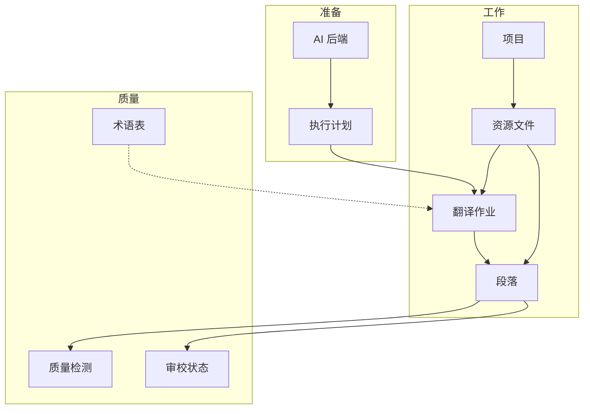

# 核心概念

阅读本页约 3 分钟，建立对 LinguaFlow 的「地图」。后文各指南中的名词都与此对齐。

## 一张图

## 概念一览

| 概念 | 是什么 | 你在界面里哪里碰到 |
| --- | --- | --- |
| **AI 后端** | 一次 AI 服务连接：提供商、模型、API Key、Base URL 等 | 「AI 后端」页 |
| **提示词模板** | 发给模型的指令模板（翻译 / 术语提取 / 术语精简） | 翻译配置 · 提示词 |
| **执行配置** | 分段、内容保护、修复、质检、上下文等行为参数 | 翻译配置 · 执行配置 |
| **执行计划** | 多轮流水线：每轮用哪个后端、什么模式（翻译 / 提取 / 裁决） | 翻译配置 · 执行计划 |
| **项目** | 一次本地化任务的容器：语言方向、资源、术语、作业 | 「项目」列表与工作区 |
| **资源** | 项目中的一个源文件（md、epub、srt…） | 工作区 · 资源 |
| **段落** | 从资源解析出的最小翻译单元 | 工作区 · 段落 |
| **作业** | 一次异步翻译任务：选资源 + 执行计划 → Worker 执行 | 工作区 · 作业 |
| **术语表** | 项目级「源术语 → 目标术语」，翻译时注入提示 | 工作区 · 术语表 |
| **审校** | 对段落译文的编辑、批准、驳回与批注 | 工作区 · 段落 |

## 本地模式 vs 服务器模式

| | 本地模式 | 服务器模式 |
| --- | --- | --- |
| 命令 | `linguaflow` / `linguaflow local` | `linguaflow serve` |
| 默认端口 | `18080` | `8080` |
| 登录 | 免登录 | 需要账号（JWT） |
| 数据 | 本机用户配置目录下的 SQLite | `./data` 或外部库 |
| 成熟度 | **推荐个人使用** | **预览中**，功能仍在完善 |

Docker 镜像默认走服务器模式与 `8080`。个人试用请优先二进制本地模式。详见 [使用模式](/zh/guide/modes)。

## 执行计划为什么重要

Web 里点「翻译」时，必须选择一份 **执行计划**。它回答：

1. 用哪一个 AI 后端调用模型  
2. 用哪套提示词与执行配置  
3. 是否在翻译前抽术语、翻译后做质量裁决  

**第一次使用**：只建「单轮翻译 + 内置通用提示词/策略」即可，见 [快速开始 · Web](/zh/guide/getting-started)。

进阶组合（提取 → 翻译 → 裁决）见 [翻译配置 · 使用](/zh/guide/translation-config)。

## 段落状态（审校）

| 状态 | 含义 |
| --- | --- |
| 待翻译 / 待处理 | 尚未得到可用译文 |
| 已翻译 | 模型已产出，待人工看 |
| 已修改 | 人工改过译文 |
| 已批准 | 审校通过 |
| 已驳回 | 审校不通过，可再译 |

创建作业时可开启 **自动审批**，跳过人工批准（适合草稿）。详见 [翻译审校](/zh/guide/review)。

## CLI 与 Web 的概念对应

| Web | CLI（近似） |
| --- | --- |
| AI 后端 + 执行计划 | `linguaflow.yaml` 中的 `backends` + `execution` |
| 项目 / 资源 / 作业 | 无持久项目模型；`translate` 直接读写文件 |
| 术语表 | `--glossary-path` 或配置中的 `glossary` |
| 段落审校 UI | 直接编辑输出文件 |

## 建议阅读顺序

1. [快速开始 · Web](/zh/guide/getting-started) 或 [快速开始 · CLI](/zh/guide/cli-quickstart)  
2. 本页（建立地图）  
3. [项目管理](/zh/guide/projects) → [术语表](/zh/guide/glossary) → [审校](/zh/guide/review)  
4. 需要调优时再读 [翻译配置 · 使用](/zh/guide/translation-config)、[翻译配置 · 参考](/zh/guide/translation-config-reference) 与 [流水线与原理](/zh/guide/pipeline)  
