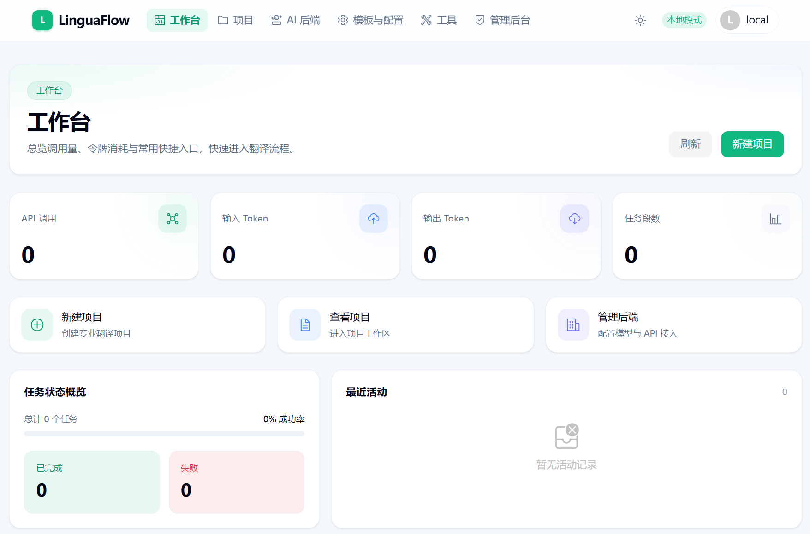
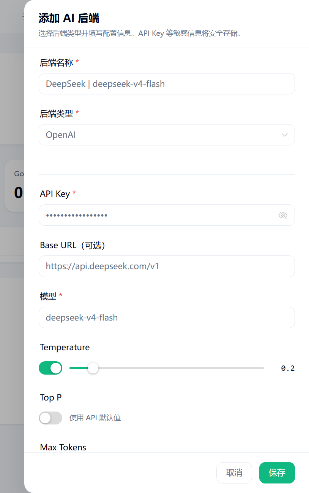

# 快速开始 · Web

目标：在约 5 分钟内完成 **第一次成功翻译**——从启动界面到看到一段可用译文。

本页只走 **最短路径**。术语提取、质量裁决、多轮流水线等见后文「下一步」。

::: tip 推荐方式
个人使用优先 **预编译二进制 + 本地模式**：免登录、数据在本机、启动后自动打开浏览器（`http://127.0.0.1:18080`）。
:::

## 1. 安装并启动

### 方式 A：预编译二进制（推荐）

1. 打开 [GitHub Releases](https://github.com/MeowSalty/LinguaFlow/releases)，下载对应平台的压缩包
2. 解压后运行：

::: code-group

```bash [Linux / macOS]
chmod +x linguaflow
./linguaflow
```

```powershell [Windows]
# 资源管理器中双击 linguaflow.exe
# 或在终端：
.\linguaflow.exe
```

:::

浏览器应自动打开 **本地模式** 界面：`http://127.0.0.1:18080`（若端口被占用会自动尝试后续端口）。



::: tip 本步成功标准
浏览器能打开 LinguaFlow 界面，且无需登录即可进入主页面（本地模式）。
:::

### 方式 B：Docker

```bash
docker pull ghcr.io/meowsalty/linguaflow:latest
docker run --rm -p 8080:8080 ghcr.io/meowsalty/linguaflow:latest
```

在浏览器打开 `http://localhost:8080`。

::: warning Docker 与二进制行为不同

|      | 二进制 / 源码双击      | Docker 默认                   |
| ---- | ---------------------- | ----------------------------- |
| 模式 | **本地模式**（免登录） | **服务器模式**（需注册/登录） |
| 端口 | `18080`                | `8080`                        |
| 适用 | 个人本机               | 容器部署、联调                |

服务器模式仍在完善中，仅建议试用。详见 [使用模式](/zh/guide/modes)。
:::

### 方式 C：从源码构建

需要 Go、Node.js、pnpm 与 [Task](https://taskfile.dev)。步骤见 [安装部署](/zh/guide/installation#从源码构建)。

---

## 2. 配置 AI 后端

翻译依赖你自己的 AI API Key，服务不会内置密钥。

1. 打开顶部导航 **AI 后端**
2. 点击 **添加后端**
3. 选择提供商并填写：

   | 提供商        | 类型        | 常用默认模型        |
   | ------------- | ----------- | ------------------- |
   | OpenAI        | `openai`    | `gpt-4o-mini`       |
   | Anthropic     | `anthropic` | `claude-sonnet-4-5` |
   | Google Gemini | `google`    | `gemini-2.5-flash`  |

4. 填入 **API Key**（必填）
5. 如需代理或本地模型（Ollama、LM Studio、Azure 等），填写兼容的 **Base URL**
6. 保存



::: tip 本地模型
OpenAI 类型可对接 OpenAI 兼容接口，例如 Ollama：`http://localhost:11434/v1`。部分网关仅接受流式请求时，在后端选项中开启 **流式请求**。
:::

::: tip 本步成功标准
「AI 后端」列表中能看到刚添加的条目，状态可用。
:::

---

## 3. 创建最简执行计划

执行计划 =「用哪个后端、按什么策略翻译」。内置有通用提示词与策略，但计划需要你关联自己的后端。

1. 打开 **翻译配置 → 执行计划**（或设置中的执行计划入口）
2. 点击 **创建计划**
3. 名称例如：`默认翻译`
4. 只添加 **一轮翻译**，其余可先不管：

   | 项              | 建议                           |
   | --------------- | ------------------------------ |
   | 模式            | **翻译**                       |
   | 后端            | 上一步创建的后端               |
   | 提示词模板      | 内置 **通用提示词**            |
   | 执行配置        | 内置 **通用策略**              |
   | 批次大小 / 字数 | 见下方「批次怎么设」           |
   | 并发            | 先用 `2`～`4`；若频繁 429 再降 |

5. **不要**在第一次就加术语提取、质量裁决等多轮（等跑通后再加）
6. 保存

### 批次怎么设

产品内置/模板里常见默认是 **`batch_size: 1`**（一次只译一段），这是为了**稳**，不是因为模型只能吃那么少。

| 场景                               | 更贴近现状的起点                                  | 说明                                                  |
| ---------------------------------- | ------------------------------------------------- | ----------------------------------------------------- |
| 第一次跑通、排错                   | `batch_size = 1`                                  | 失败好定位，与内置默认一致                            |
| 短段多（字幕、列表、UI 文案）      | `batch_size = 8`～`20`，或主要靠字数              | 段短，多段合批能明显减少请求次数                      |
| 中等段落（普通 Markdown）          | `batch_size = 4`～`10`                            | 多数 128k+ 模型足够；再观察失败率                     |
| 长段、结构复杂（大表、长 HTML 块） | `batch_size` 保持小，或 **`max_words_per_batch`** | 单段本身就可能很长                                    |
| 推荐稳态（通用）                   | **`batch_size` 作软上限 + `max_words_per_batch`** | 例如段数 `10` + 字词 `1500`～`3000`（按模型与语言调） |

**要不要用字数？建议要。** 系统支持双重约束（段落数 **且** 字词数，任一触顶就切批）：

- 只设 `batch_size`：10 段短字幕很轻松，10 段长文可能一次塞爆输出或 JSON
- 只设 / 同时设 `max_words_per_batch`：按源文字词量打包，长短不一的文档更稳

字词统计规则：CJK 大致按字计，其它语言按空白分词（与代码中 `CountWords` 一致）。  
上下文窗口大，不等于「一批越大越好」——还要留出：**系统提示词、术语表、前后文、结构化 JSON 协议，以及译文输出长度**。批次过大时更常见的是解析失败、漏段、占位符损坏，而不只是「上下文不够」。失败时流水线会按 `fallback_shrink` 自动缩小批次重试，但起点过大仍会浪费请求。

::: tip 成功标准（本步）
计划列表中能看到刚建的计划，且其中至少有一轮绑定了你的后端。
:::

---

## 4. 创建项目并上传文件

1. 打开 **项目** → **新建项目**
2. 填写：

   | 字段     | 建议              |
   | -------- | ----------------- |
   | 项目名称 | 任意，如 `试用`   |
   | 源语言   | `auto` 或明确语言 |
   | 目标语言 | 如简体中文        |

3. 进入项目工作区 → **资源** 标签
4. 上传一个小文件试水，例如：
   - 一篇短 Markdown（`.md`）
   - 或一小段字幕（`.srt`）

等待解析完成（资源列表出现该文件即可）。

> **界面示意（占位）** · 项目工作区 · 资源  
> 资源列表显示文件名、格式与解析状态；支持拖拽上传。顶部有项目语言方向与统计。  
> _待补截图：`docs/public/images/workspace-resources.png`_

支持的格式一览见 [格式支持](/zh/guide/formats)。

::: tip 本步成功标准
项目列表中有项目；工作区「资源」中出现已解析的文件。
:::

---

## 5. 开始翻译并查看结果

1. 在资源列表选中刚上传的文件
2. 点击 **翻译**
3. 在面板中选择第 3 步的执行计划
4. 其余选项可保持默认（首次不必开「自动审批」）
5. 点击 **开始翻译**
6. 在 **作业** 标签查看进度；完成后打开 **段落** 标签查看原文与译文

> **界面示意（占位）** · 作业进度与段落结果  
> 「作业」标签显示进度 / ETA；完成后在「段落」中左右对照原文与译文。  
> _待补截图：`docs/public/images/job-and-segments.png`_

::: tip 第一次成功的标志（请逐项确认）

| #   | 标志                                        | 在哪里看          |
| --- | ------------------------------------------- | ----------------- |
| 1   | 作业状态为 **已完成**（或大部分段落已翻译） | 工作区 → **作业** |
| 2   | 段落列表中能看到 **译文**                   | 工作区 → **段落** |
| 3   | 能对某一段 **编辑 / 审批**                  | 段落行内操作      |
| 4   | （可选）能 **下载** 翻译结果文件            | 资源页下载        |

若作业失败，先看作业错误信息，并对照 [常见问题](/zh/guide/faq)（API Key、限速、端口、执行计划等）。
:::

## 常用支持格式（速查）

| 类型   | 扩展名                                                 |
| ------ | ------------------------------------------------------ |
| 文档   | `.md` / `.markdown` / `.mdx`、`.html`、`.docx`、`.txt` |
| 电子书 | `.epub`                                                |
| 字幕   | `.srt` / `.vtt` / `.ass`                               |
| 结构化 | `.json` / `.yaml` / `.yml` / `.toml`                   |

---

## 下一步

跑通最短路径后，按需深入：

| 目标                               | 文档                                                                                 |
| ---------------------------------- | ------------------------------------------------------------------------------------ |
| 弄清项目 / 资源 / 作业 / 计划      | [核心概念](/zh/guide/concepts)                                                       |
| 终端批量翻译、CI 集成              | [快速开始 · CLI](/zh/guide/cli-quickstart)                                           |
| 术语表、自动提取                   | [术语表管理](/zh/guide/glossary)                                                     |
| 审校、质检、筛选                   | [翻译审校](/zh/guide/review)                                                         |
| 多轮计划、质量裁决、保护规则       | [翻译配置 · 使用](/zh/guide/translation-config) · [流水线与原理](/zh/guide/pipeline) |
| 安装细节、Docker Compose、数据目录 | [安装部署](/zh/guide/installation)                                                   |
| 本地模式 vs 服务器模式             | [使用模式](/zh/guide/modes)                                                          |
