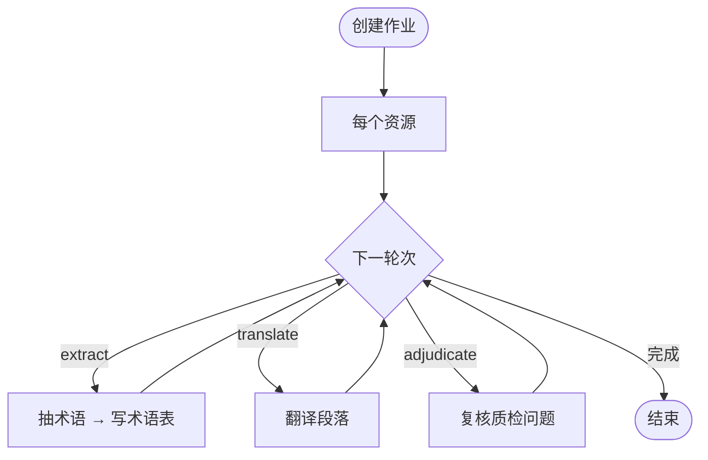

# 流水线与原理

本页说明翻译 **如何执行**：多轮计划、内容保护、响应修复、批量与重试、质量裁决等。偏「为什么 / 内部怎么走」。

::: tip 查字段与界面步骤

- 界面怎么配：[翻译配置 · 使用](/zh/guide/translation-config)
- 字段与默认值：[翻译配置 · 参考](/zh/guide/translation-config-reference)
- CLI 配置文件：[配置文件与环境变量](/zh/guide/configuration)
  :::

## 作业如何跑起来

创建翻译作业时，系统会 **固化** 当前执行计划快照，后台 Worker 按资源依次处理。



**翻译轮次内部（简要）：**

1. 内容保护（占位符替换）
2. 组装上下文 → 调用 AI
3. 还原占位符 / 后处理 / 可选 Ruby 还原
4. 规则质检写回段落

可选：执行配置中的 **内联术语自举** 会在翻译响应中一并抽术语。

推荐轮次顺序：`extract`（可选）→ `translate`（可多轮）→ `adjudicate`（可选）。

---

## 多轮翻译：级联回退

多个 **`translate` 轮次** 不是「润色流水线」，而是 **失败回退**：

```text
Round 1：尝试全部待译段落
  ├─ 成功 → 写入，该段结束
  └─ 失败 → 交给 Round 2
Round 2：只处理 Round 1 失败的段落
  └─ …
```

**典型用途：** 主模型失败换备用模型；第二轮更小批次 / 更低并发提高成功率。

提取轮次在翻译前写术语；裁决轮次在规则质检之后做降噪。配置入口见 [翻译配置 · 使用 · 执行计划](/zh/guide/translation-config#执行计划)。

---

## 批量与并发

每轮按 `batch_size`（段落数）与/或 `max_words_per_batch`（字词数）组批，Worker 池并发请求。

- CJK 常按字符计词；非 CJK 常按空白分词
- 批次会带上上下文窗口，保证连贯
- **失败降级**：整批失败时按 `fallback_shrink` 缩小批次（默认约一半）再试，最小可到 1 段
- 仍失败的段落可进入下一翻译轮次

字段表见 [翻译配置 · 参考 · translate](/zh/guide/translation-config-reference#translate)。

---

## 内容保护

翻译前将代码、链接、占位符、HTML 标签等换成 `__LF_000001__` 形式（固定宽度编号），译后还原。

- 默认规则：`code` / `link` / `placeholder` / `xml`
- 相邻占位符可能合并，减少对模型的干扰
- 模型应 **原样保留** 占位符字符串

规则列表见 [翻译配置 · 参考 · protect](/zh/guide/translation-config-reference#内容保护-protect)。

---

## 上下文窗口

为当前段附带前后各 N 段作 **只读参考**（不译）。

- 优先用保护前的原文，便于模型阅读
- `max_chars` > 0 时在句末附近截断
- 跳过空段、纯占位符、装饰分隔线

参数见 [翻译配置 · 参考 · context](/zh/guide/translation-config-reference#上下文-context)。

---

## 响应修复

模型输出不总是合法 JSON。修复链大致包括：

| 级别     | 内容                                             |
| -------- | ------------------------------------------------ |
| 结构     | BOM/控制字符、括号、尾逗号等                     |
| 别名     | `translation` / `result` 等映射到 `translations` |
| 部分结果 | 部分段缺失时只重试缺失段（受阈值控制）           |
| 占位符   | 大小写/下划线变体归一                            |
| 提示升级 | 附加反例 reminder 再请求一次                     |

纯文本模式下还有去围栏、解析 `[glossary]` / `[ruby]` 等逻辑。开关见 [翻译配置 · 参考 · repair](/zh/guide/translation-config-reference#响应修复-repair)。

---

## 术语提取（Bootstrap）

| 模式                                  | 机制                                     |
| ------------------------------------- | ---------------------------------------- |
| **独立提取**（计划 `extract` 或 pre） | 译前单独调用，写术语表，后续翻译轮次共享 |
| **内联**（执行配置 bootstrap）        | 翻译响应中顺带返回术语，省一次调用       |

内联冲突策略：

| 策略                    | 行为                               |
| ----------------------- | ---------------------------------- |
| `rewrite-local`（默认） | 冲突时以术语表权威译法改写本批译文 |
| `off`                   | 先到先得，文档内可能不一致         |

产品操作见 [术语表管理](/zh/guide/glossary)；字段见 [翻译配置 · 参考](/zh/guide/translation-config-reference#术语自举-bootstrap)。

---

## 规则质检与 AI 质量裁决

### 规则质检

翻译后自动标问题，例如：

| code              | 含义           | 可否 AI 裁决 |
| ----------------- | -------------- | ------------ |
| `length_ratio`    | 过短/过长      | ✅ 软规则    |
| `duplicate`       | 相邻译文重复   | ❌ 硬规则    |
| `untranslated`    | 译文=原文      | ❌ 硬规则    |
| `source_residual` | 译文夹源语脚本 | ✅ 软规则    |

源语残留按 Unicode 脚本与语言对分档（独立脚本偏严；共汉字语言对有不同策略）。源语言为 `auto` 时残留检测不生效。

审校筛选见 [翻译审校](/zh/guide/review#质量检测)。

### 质量裁决（`adjudicate`）

对软规则问题逐条问 AI：`real` 保留 / `false_positive` 剔除。

1. 只处理已译/已改且带可裁决 code 的段落
2. 分批调用 **内置** 裁决提示词
3. 解析失败时 **保留原问题**，不清空

**建议：** 放在翻译轮次之后；专有名词多的文档优先开 `source_residual`。配置见 [翻译配置 · 使用](/zh/guide/translation-config#进阶组合)。

---

## Ruby 注音

含 `<ruby>` 的 HTML：

1. **译前** 抽出注音，正文只留 base
2. **译后** 按类型过滤，把标签插回译文
3. 本地对齐失败时，可用计划级 **Ruby 重试** 再调一次 LLM

类型：`phonetic` / `semantic` / `creative`。字段见 [翻译配置 · 参考 · ruby](/zh/guide/translation-config-reference#ruby-ruby)。

---

## 速率限制与重试

### 限速

后端 `rate_limit_per_minute`：令牌桶，超限等待而非丢弃。`0` 表示不限。

### 错误策略（摘要）

| 场景       | 行为                                         |
| ---------- | -------------------------------------------- |
| 429 / 503  | 退避后重试；尊重 `Retry-After`，常有最小等待 |
| 网络/超时  | 缩小批次再试                                 |
| 解析失败   | 先提示升级修复，再缩小批次                   |
| 401 / 403  | 不重试，留给后续轮次                         |
| 部分段缺失 | 同轮再组批一次                               |

重试参数：`max_attempts` / `backoff_ms` / `jitter`（指数退避 + 抖动）。见 [翻译配置 · 参考 · 重试](/zh/guide/translation-config-reference#重试-retry)。

---

## 插件（规划中）

::: warning 尚未实现
计划通过 Lua 脚本挂 `before_translate` / `after_translate` 等钩子。当前仅有接口与配置占位，请勿依赖。
:::

```yaml
plugins:
  enabled: false
  scripts: []
```

---

## 下一步

- [翻译配置 · 使用](/zh/guide/translation-config) · [翻译配置 · 参考](/zh/guide/translation-config-reference)
- [翻译审校](/zh/guide/review) · [术语表管理](/zh/guide/glossary)
- [常见问题](/zh/guide/faq)
