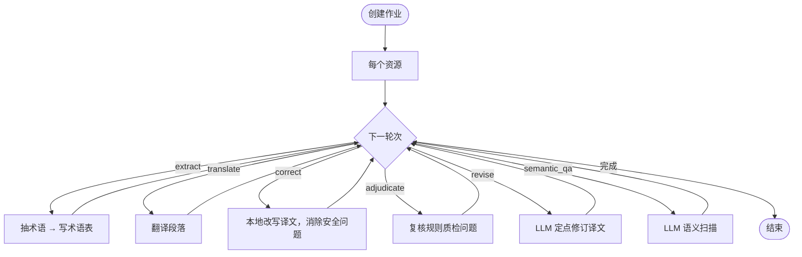

# 流水线与原理

本页说明翻译 **如何执行**：多轮计划、内容保护、响应修复、批量与重试、质量裁决等。偏「为什么 / 内部怎么走」。

::: tip 查字段与界面步骤

- 界面怎么配：[翻译配置 · 使用](/zh/guide/translation-config)
- 字段与默认值：[翻译配置 · 参考](/zh/guide/translation-config-reference)
- CLI 配置文件：[配置文件与环境变量](/zh/guide/configuration)
  :::

## 作业如何跑起来

创建翻译作业时，系统会 **固化** 当前执行计划快照，后台 Worker 按资源依次处理。


```mermaid
flowchart TD
  Start([创建作业]) --> Res[每个资源]
  Res --> Next{下一轮次}
  Next -->|extract| Ex[抽术语 → 写术语表]
  Next -->|translate| Tr[翻译段落]
  Next -->|correct| Co[本地改写译文，消除安全问题]
  Next -->|adjudicate| Ad[复核规则质检问题]
  Next -->|revise| Re[LLM 定点修订译文]
  Next -->|semantic_qa| Sq[LLM 语义扫描]
  Next -->|完成| Done([结束])
  Ex --> Next
  Tr --> Next
  Co --> Next
  Ad --> Next
  Re --> Next
  Sq --> Next
```

**翻译轮次内部（简要）：**

1. 内容保护（占位符替换）
2. 组装上下文 → 调用 AI
3. 还原占位符 / 后处理 / 可选 Ruby 还原
4. 规则质检写回段落（18 项 per-batch checker + 1 项文档级 + 注音守恒码）

可选：执行配置中的 **内联术语自举** 会在翻译响应中一并抽术语。语义质检产生的 `warning` 级问题通过 `span` 精确定位到译文片段。可选的 `revise` 轮按段落上 `pending` 语义 issue 对现有译文做定点最小修订。

推荐轮次顺序：`extract`（可选）→ `translate`（可多轮）→ `correct`（可选）→ `adjudicate`（可选）→ `revise`（可选）→ `semantic_qa`（可选）。

---

## 多轮翻译：级联回退

多个 **`translate` 轮次** 不是「润色流水线」，而是 **失败回退**：

```text
Round 1：尝试全部待译段落
  ├─ 成功 → 写入，该段结束
  └─ 失败 → 交给 Round 2
Round 2：只处理 Round 1 失败的段落
  └─ …
```

**典型用途：** 主模型失败换备用模型；第二轮更小批次 / 更低并发提高成功率。

提取轮次在翻译前写术语；裁决轮次在规则质检之后做降噪。配置入口见 [翻译配置 · 使用 · 执行计划](/zh/guide/translation-config#执行计划)。

---

## 批量与并发

每轮按 `batch_size`（待译段落数）与/或 `max_words_per_batch`（字词数）组批，Worker 池并发请求。

- CJK 常按字符计词；非 CJK 常按空白分词
- **`batch_size` 只数待译段**，不把上下文段算进去；`max_words_per_batch` 则把上下文段的字数也计入预算（避免上下文把整批塞满）。纯行数模式（二者与 `context.max_chars` 均为 0）时上下文体积不受约束
- 批次会带上上下文窗口，保证连贯；组批时还会**预估上下文段的词数并扣减预算**，避免因上下文膨胀导致批次超限
- **失败降级（池化缩批）**：`fallback_shrink` 是翻译轮的必填系数（合法域 (0, 1]）——`1.0` 启用多池同尺寸重切，`(0,1)` 启用多池缩批，失败段按更小的批次约束重试，直到最小 1 段
- 仍失败的段落可进入下一翻译轮次

### 池化缩批怎么走

`fallback_shrink` 是池缩比系数（必填，合法域 (0, 1]）。各池串行执行，前一个池里失败的批次会重新切批、进入下一个更小的池；`1.0` 时各池同尺寸（只重切不缩小），`(0,1)` 时每池按系数缩小：

```text
池 0：批次约束 = 原始 batch_size（或 max_words_per_batch）
  ├─ 成功 → 写入，该段结束
  └─ 失败 → 交给池 1
池 1：批次约束 = floor(原始 × shrink)        （shrink=1.0 时与池 0 相同）
  └─ 失败 → 交给池 2
池 2：批次约束 = floor(原始 × shrink²)       （shrink=1.0 时仍相同）
  └─ … 直到最小 1 段
```

**关键参数**：

- **池数量 = `retry.max_attempts + 1`**——`max_attempts` 决定池深度，每池在途重试预算内部封顶 `min(max_attempts, 3)`、不单独暴露
- 最坏情况下单段调用次数 ≈ `(max_attempts + 1)²`（每池重试 × 池数）
- 各池之间是**串行**的，只有前一池失败的段才会进下一池；成功段不会被重复处理

工作区作业时间线会以「池级事件」卡片展示当前所处池、批次数与待处理数，方便观察缩批进度。

::: tip 不缩只重切用 1.0
`fallback_shrink = 1.0` 时多池批次约束相同，相当于「失败段重新按原批次大小再试一遍」而非缩小批次；适合响应稳定、但偶发解析失败需要重切的后端。`0` 非法（会被后端拒绝）；确需单池不重切，请减少 `retry.max_attempts`。
:::

字段表见 [翻译配置 · 参考 · translate](/zh/guide/translation-config-reference#translate)；重试参数见 [翻译配置 · 参考 · 重试](/zh/guide/translation-config-reference#重试-retry)。

---

## 内容保护

翻译前将代码、链接、占位符、HTML 标签等换成 `__LF_000001__` 形式（固定宽度编号），译后还原。

- 默认规则：`code` / `link` / `placeholder` / `xml`
- 相邻占位符可能合并，减少对模型的干扰
- 模型应 **原样保留** 占位符字符串

规则列表见 [翻译配置 · 参考 · protect](/zh/guide/translation-config-reference#内容保护-protect)。

---

## 上下文窗口

为当前段附带前后各 N 段作 **只读参考**（不译）。

- 优先用保护前的原文，便于模型阅读
- `max_chars` > 0 时按 rune 计数截断并补省略号（在句末附近截断，保留可读性）
- 跳过空段、纯占位符、装饰分隔线

### 与批次预算的关系

上下文段会**占用 `max_words_per_batch` 的字词预算**（但不计入 `batch_size` 的段落数）。为防止「上下文比待译正文还长」把整批顶到超限，组批时会先**预估上下文段的词数**并从预算里扣减，再决定一个批次能装多少待译段。预估逻辑与实际上下文选段一致，避免「预估小、实际大」的偏差。

这意味着：开大上下文窗口（`before`/`after` 较大）时，每个批次的待译段数会自动变少，无需手动调小 `batch_size`。`batch_size` 与 `max_words_per_batch` 都为 0 的纯行数模式下上下文体积不受约束，仅在确信上下文很短时使用。

参数见 [翻译配置 · 参考 · context](/zh/guide/translation-config-reference#上下文-context)。

---

## 响应修复

模型输出不总是合法 JSON。修复链大致包括：

| 级别     | 内容                                             |
| -------- | ------------------------------------------------ |
| 结构     | BOM/控制字符、括号、尾逗号等                     |
| 别名     | `translation` / `result` 等映射到 `translations` |
| 占位符   | 大小写/下划线变体归一                            |
| 提示升级 | 附加反例 reminder 再请求一次                     |

修复层只负责把响应解析成**可解析的翻译 ID 列表**——即「哪些段拿到了译文」。个别段没回（部分段缺失）**不再在修复配置里单独开关**，而是直接交给 [池化缩批重试](#批量与并发)：缺失段进入更小的池按更小批次重译，由上层引擎统一管理。这样把「解析」与「重试」两个职责解耦，修复配置也更简洁。

纯文本模式下还有去围栏、解析 `[glossary]` / `[ruby]` 等逻辑。开关见 [翻译配置 · 参考 · repair](/zh/guide/translation-config-reference#响应修复-repair)。

---

## 术语提取（Bootstrap）

| 模式                                  | 机制                                     |
| ------------------------------------- | ---------------------------------------- |
| **独立提取**（计划 `extract` 或 pre） | 译前单独调用，写术语表，后续翻译轮次共享 |
| **内联**（执行配置 bootstrap）        | 翻译响应中顺带返回术语，省一次调用       |

内联冲突策略：

| 策略                    | 行为                               |
| ----------------------- | ---------------------------------- |
| `rewrite-local`（默认） | 冲突时以术语表权威译法改写本批译文 |
| `off`                   | 先到先得，文档内可能不一致         |

产品操作见 [术语表管理](/zh/guide/glossary)；字段见 [翻译配置 · 参考](/zh/guide/translation-config-reference#术语自举-bootstrap)。

---

## 规则质检与 AI 质量裁决

### 规则质检

翻译轮次内由 QA 引擎同步跑规则检查并写回段落。共 18 项 per-batch checker（可在执行配置 `qa.checks` 中按名选择性启用）+ 1 项文档级 `duplicate_source_divergence`（跨段比对，不可在 `qa.checks` 中关闭）；另由翻译轮的注音守恒逻辑产出 `ruby_restore_incomplete` / `ruby_tag_loss` 两个守恒码：

| code                          | 含义                                           | 可否 AI 裁决 |
| ----------------------------- | ---------------------------------------------- | ------------ |
| `length_ratio`                | 过短/过长                                       | ✅ 软规则    |
| `duplicate`                   | 相邻译文完全相同                               | ❌ 硬规则    |
| `duplicate_source_divergence` | 文档级同源异译                                 | ❌ 文档级    |
| `untranslated`                | 译文=原文                                       | ❌ 硬规则    |
| `source_residual`             | 译文夹源语脚本                                 | ✅ 软规则    |
| `punctuation_pairing`         | 标点配对不平衡                                 | ❌ 硬规则    |
| `punctuation_missing`         | 源文整类包裹标点在译文中完全缺失               | ❌ 硬规则    |
| `punctuation_surplus`         | 译文多出源文所无的成对包裹标点                 | ✅ 软规则    |
| `punctuation_wrap_loss`       | 源文整段被成对引号包裹，译文首尾丢失外层引号   | ✅ 软规则    |
| `ruby_restore_incomplete`     | 翻译轮该段应还原的 `<ruby>` 注音只还原了部分   | ❌ 软规则    |
| `ruby_tag_loss`               | 人工编辑把原本含注音的译文改到一条注音不剩     | ❌ 软规则    |
| `whitespace_irregular`        | 零宽/NBSP/制表符等异常空白                     | ❌ 硬规则    |
| `repeated_space`              | 连续空格 / CJK 间空格                          | ❌ 硬规则    |
| `width_mix`                   | 全/半角混用（仅检零歧义安全集：CJK 译文的 `! ? , ; : ( ) [ ]` 半角标点与拉丁译文的全角字符 FF01-FF5E，数字写法如 `1,000`/`12:30`/`5!` 豁免） | ❌ 硬规则    |
| `number_mismatch`             | 阿拉伯数字集合不一致（全角数字归一化后比对）   | ❌ 硬规则    |
| `url_email_mismatch`          | URL/邮箱集合不一致                             | ❌ 硬规则    |
| `subtitle_line_count`        | 字幕行数不一致                                 | ❌ 硬规则    |
| `forbidden_term`              | 命中禁译词条却仍出现在译文                     | ❌ 硬规则    |
| `term_inconsistency`          | 命中强制词条但译文未用 target                  | ❌ 硬规则    |
| `leftover_placeholder`        | 译文残留 `__LF_*` 占位符                       | ❌ 硬规则    |
| `xml_tag_mismatch`           | XML 标签集合不一致                             | ❌ 硬规则    |

源语残留按 Unicode 脚本与语言对分档（独立脚本偏严；共汉字语言对有不同策略）。源语言为 `auto` 时残留检测不生效。规则与可裁决性等细节见 [翻译审校 · 质量检测](/zh/guide/review#质量检测)。

#### 保护区：不被原文结构干扰

很多 checker（标点配对、空白、全/半角混用等）盯着译文里的字符细节。可原文里本来就带着 HTML 标签、URL 等结构（它们在译文里已被还原回来），如果直接在还原后的整串上跑 checker，这些结构里的英文标点、空格会被当成译文问题误报。

LinguaFlow 用**保护区**解决：QA 引擎拿到内容保护阶段记录的占位符映射，在译文里把属于原文结构的区段标出来，checker 在这些区段上**跳过检测**，但保护区之外的真问题仍照常定位上报。效果是——HTML 标签、链接等原文结构不再制造噪声 issue，而译文人手写错的标点、空白依旧被抓。

::: tip XML 标签与 Ruby 注音
通用的 `xml_tag_mismatch` 比对源/译 XML 标签多重集时，会**排除 `<ruby>`/`<rt>`/`<rp>`/`<rb>` 注音标签族**——这些标签的守恒由 Ruby 还原子系统独立负责（`preserve_kinds` 过滤会合法地从译文移除它们），在通用标签比对里排除能避免配置耦合产生的误报。
:::

### 质量裁决（`adjudicate`）

对软规则问题逐条问 AI：`real` 保留 / `false_positive` 标记为 `dismissed`（保留记录、后续轮次跳过）。

1. 只处理已译/已改且带可裁决 code（`source_residual` / `length_ratio` / `punctuation_surplus`）的段落
2. 分批调用 **内置** 裁决提示词
3. 解析失败时 **保留原问题**，不清空

**建议：** 放在翻译轮次之后；专有名词多的文档优先开 `source_residual`。不配 `adjudicate_codes` 时默认裁决 `source_residual` 与 `punctuation_surplus`；`length_ratio` 需显式勾选。配置见 [翻译配置 · 使用](/zh/guide/translation-config#进阶组合)；协议细节见 [翻译配置 · 参考 · adjudicate](/zh/guide/translation-config-reference#adjudicate)。

### 本地改写（`correct`）

纯本地的机械修正轮次，**不调 LLM、无后端、无重试**。消费规则质检已报出的安全问题，按 `rules` 顺序对译文做确定性改写：

1. 扫描 `translated` / `edited` 且译文非空的段——按文档自动扫描时只处理 `Translate=true` 的段（用户未选中的段不会被机械纠错）；跨轮增量会排除已被前一同模式轮解决的段
2. 规则按配置顺序执行，**首个生效改写即停**（不叠加）；已被裁决为 `dismissed` 的问题不触发改写
3. **幂等校验**：改写后用同一 checker（规则声明 `ResolvedCodes` 的并集）重跑——若该 issue code 仍报出，则**回滚译文、保留原问题**，避免把「没修好」伪装成「已修好」。已被 `dismissed` 的问题指纹不计入校验、其裁决记录保留，避免把用户判定为「不是问题」的项又改回去

首发规则 `punctuation_missing_wrap`：当源文是单段配对引号包裹（`「…」` / `“…”` / `『…』` 等）且译文丢失该引号时，自动在译文首尾补回对应开闭引号；多段包裹、译文已有该引号、非配对引号等不安全场景一律不处理。该规则只对仍处于 `pending` 的问题触发，已 `dismissed` 的不再修复。

另有 `punctuation_wrap_loss_wrap`（补回整段丢失的外层引号）与 `width_mix_normalize`（把 `width_mix` 报出的零歧义全/半角混用按目标语方向归一：CJK 转全角、拉丁转半角，数字写法如 `1,000`/`12:30`/`5!` 豁免）。执行计划编辑器会列出全部已知规则，模板未保存过的规则以关闭状态出现，可自行开启。规则清单与行为见 [翻译配置 · 参考 · correct](/zh/guide/translation-config-reference#correct)。

::: tip 修复、修订、裁决、语义质检各管一段
- `correct` / `revise` 都**改写译文**以消除已报出的问题：`correct` 纯本地机械修复高频安全问题、不调 LLM；`revise` 调 LLM 按语义 issue 做定点最小修订。两者都沿用幂等契约——改写后重跑确定性 QA 验证，改不掉就回滚
- `adjudicate` 只判断已有软规则问题**保留 / 标记为 `dismissed`**、不改译文
- `semantic_qa` **新增**语义类问题

四者互补，可叠加放在翻译轮次之后。
:::

配置字段见 [翻译配置 · 参考 · correct](/zh/guide/translation-config-reference#correct)；可修复的 issue code 与 [翻译审校 · 质量检测](/zh/guide/review#质量检测) 对应。

### LLM 修订（`revise`）

以段落上 `pending`（未裁决 `dismissed`）的语义 issue 为修复目标，调 LLM 对**现有译文**做最小改动的定点修订（不重译原文），系统提示词内置、不可覆盖。与 `correct` 共享写回契约：

1. 仅处理 `translated` / `edited` 且译文非空的段，按 `segment_scope`（`with_issues` / `with_issue_codes`）扫描——只取段落上 `pending` 的语义 issue 作修复目标
2. `issue_codes` 仅取 8 个语义白名单（`calque` / `term_fidelity` / `naturalness` / `mistranslation` / `omission` / `addition` / `grammar` / `register`），与段落实有 `pending` 语义 issue 取交集，交集为空的段不进入修订
3. protect/ruby 及引擎级策略（repair/QA/glossary）经计划级 `profile_id` 贯穿，无需依赖计划内 translate 轮
4. 写回遵循 correct 先例：改写译文与 issues、不改段落状态、CAS 保护；**无 `fallback_shrink`**（修订失败模式与批次大小无关，不缩批）

`revise` 是把语义质检/裁决产出但尚未解决的 `pending` 语义问题，交给 LLM 做定点最小修订，而不是整段重译。与 `correct` 的差别在于：`correct` 纯本地、修高频安全问题；`revise` 调 LLM、按语义问题定点修订。配置字段见 [翻译配置 · 参考 · revise](/zh/guide/translation-config-reference#revise)。

### 语义质检（`semantic_qa`）

用 LLM 扫描已译段落，捕获规则无法覆盖的语义问题（如 `mistranslation` / `calque` / `omission` / `addition` / `grammar` / `register` / `term_fidelity` / `naturalness`）：

1. 系统提示词 **内置**（不可改），内部已显式排除规则负责的 code，不重复报
2. 输出为 `warning` 级问题，带 `span` 精确定位，**直接进人审，不经裁决**
3. 扫描范围可按 `segment_scope` 限定（`all` / `with_issues` / `with_issue_codes`），成本敏感时可只扫高价值子集
4. 扫描失败采用**软警告**：写入资源 `warning_message`，作业继续而非终态失败

::: tip 裁决、语义质检、修订的差异
- 裁决只对已有规则问题做「保留/剔除」，不新增、不改译文
- 语义质检**新增**语义类问题
- 修订对段落上 `pending` 的语义问题**定点改写译文**、不新增问题

三者互补，不冲突：语义质检把语义问题报出，修订再把 `pending` 的语义问题定点修掉。
:::

协议细节见 [翻译配置 · 参考 · semantic_qa](/zh/guide/translation-config-reference#semantic-qa)。审校侧呈现见 [翻译审校 · 质量检测](/zh/guide/review#质量检测)。

---

## Ruby 注音

含 `<ruby>` 的 HTML：

1. **译前** 抽出注音，正文只留 base
2. **译后** 按类型过滤，把标签插回译文
3. 本地对齐失败时，可用计划级 **Ruby 重试** 再调一次 LLM

类型：`phonetic` / `semantic` / `creative`。字段见 [翻译配置 · 参考 · ruby](/zh/guide/translation-config-reference#ruby-ruby)。

---

## 速率限制与重试

### 限速

后端 `rate_limit_per_minute`：令牌桶，超限等待而非丢弃。`0` 表示不限。

### 超时

后端 `timeout`（默认 60 秒）可关闭：关闭后实际请求不设时限，适合本地大模型或慢响应网关。本地超时与父上下文截止区分处理——本地超时按可重试错误退避重试，父上下文截止则跳过重试。

### 错误策略（摘要）

LLM 请求层：

| 场景       | 行为                                                       |
| ---------- | ---------------------------------------------------------- |
| 429 / 503  | 退避后重试；尊重 `Retry-After`，常有最小等待               |
| 网络/超时  | 缩小批次再试（本地超时按可重试退避）                       |
| 解析失败   | 先提示升级修复，再缩小批次                                 |
| 401 / 403  | 不重试，留给后续轮次                                       |
| 漏译段     | 清空该段 Target/Issues（防旧裁决跨轮复活），按本轮失败进入重试 |
| 部分段缺失 | 进入池化缩批，缺失段按更小批次重译（见 [批量与并发](#批量与并发)） |

重试参数：`max_attempts` / `backoff_ms` / `jitter`（指数退避 + 抖动）。见 [翻译配置 · 参考 · 重试](/zh/guide/translation-config-reference#重试-retry)。

#### 漏译段清空

某翻译轮里 LLM 漏译的段落（本轮无产出）不再静默沿用数据库里的旧译文及其旧问题裁决——旧裁决跨轮复用会让上一轮已 `dismissed` 的问题「复活」。引擎会清空该段的 Target 与 Issues，按「本轮无产出 / 失败」处理进入重试。用户看到的是：漏译段被明确标记待重跑，而不是带着陈旧裁决标记的旧译文。

#### 末轮未决软警告

当 `adjudicate` 或 `revise` 作为计划的最后一轮仍有未决段落时，任务不会硬失败，而是在完成提示里追加软警告：

- `adjudicate` 末轮：提示「质量裁决未完全成功：N 个段落未能完成裁决（issue 保持待决，可重试任务或调整参数后重试）」
- `revise` 末轮：提示「修订未完全成功：N 个段落未能完成」

多类软警告（语义质检、裁决、修订）会在完成信息里用「; 」拼接并列返回，后发生的警告不再覆盖先前的，一次看到全部未完成提示。语义质检扫描阶段的软警告另写入资源 `warning_message`，见 [翻译审校 · 任务级资源警告](/zh/guide/review#任务级资源警告)。

#### 持久化层错误分类

每段译文/QA 结果写回数据库时，LinguaFlow 会对底层错误分级（按数据库驱动分别识别 SQLite / PostgreSQL 的错误码），避免把可恢复的瞬时故障当成硬失败：

| 错误性质 | 典型来源 | 行为 |
| --- | --- | --- |
| **结构性错误** | schema 不匹配、字段缺失、约束违反等 | **fail-fast**，整轮中止并上报，避免后续段重复踩坑 |
| **瞬时错误** | 连接断开、锁竞争、临时不可写等 | 跳过本段写回、段保持 `pending`，**留给同作业后续 translate 轮次重试** |
| 正常写入 | — | 正常落库 |

设计要点：

- 每轮 `translate` 开始时重置「瞬态失败段」追踪集合；本轮瞬时失败的段不写最终译文，保留 `pending` 状态供下一轮再次取到
- 这意味着多轮计划里，靠后的 `translate` 轮有机会「兜住」前一轮因数据库瞬时故障漏掉的段，而不是整轮作废
- 该机制对用户透明：你只会在作业日志中看到部分段被标记为重试，无需手动干预

---

## 单段预览（试译 / 修订）

正式作业之外，可对单个段直接发起 **预览**：不创建作业、不持久化中间结果、不污染术语表/翻译记忆，在内存沙箱里跑一遍后决定是否应用。分两类：

- **试译预览**：选一个执行计划，对一段**原文**完整跑一遍 `extract → translate → adjudicate → semantic_qa`，产出全新译文
- **修订预览**：以段落上 `pending` 的语义 issue 为修复目标，对**现有译文**做一次 LLM 修订（`revise`），产出定点最小修订的译文；计划须含 `revise` 轮，只有 `translate` 轮时由后端合成默认修订轮。修订结果会在内存中重跑确定性 QA 作为最终 issues，无实质改动时不返回 `apply_token`

二者共用如下机制：

- **诊断输出**：批次事件携带 `round_index` / `attempt` / `system_prompt` / `user_message` / `response_format` / `json_schema` / `response_content`，用于排查提示词、响应格式与批次问题
- **用量计量**：调用次数与 token 消耗按预览口径统计，与正式作业区分；修订预览的唯一持久化副作用是记录真实预览用量
- **应用译文**：存在可应用结果时返回带签名的 `apply_token`（有过期时间，二者共用同一 `apply` 端点、令牌内 `kind` 区分翻译/修订）；应用时用令牌做基线（source / target / status）条件更新，检测到段落已变化会拒绝，避免覆盖他人改动
- **内存隔离**：术语表用内存 overlay、翻译记忆用 Noop，确保预览的副作用留在沙箱内
- **并发限制**：试译与修订预览共享全局并发上限，满时返回 429 并带 `Retry-After`；超时（默认 5 分钟）返回 504

### 多轮试译的过滤语义

试译支持多轮执行计划。对 `translate` 轮次，目标段是否纳入遵循如下规则：

| 轮次位置 | 目标段处理 |
| --- | --- |
| **首个 `translate` 轮** | **强制翻译**，无视目标段当前状态——保留「预览即重译」的语义 |
| **后续 `translate` 轮** | 按 [`segment_filter`](/zh/guide/translation-config-reference#translate) 判断：目标段状态符合过滤条件才纳入，否则**跳过本轮**，保留上一轮译文作为后续轮次的上下文 |

`extract` / `adjudicate` / `semantic_qa` 等非 translate 轮次始终处理目标段，其筛选逻辑由各自 handler 按状态自行完成，不受此规则影响。

换句话说：如果你用一个「翻译 → 裁决 → 再翻译」的计划做试译，第二个翻译轮只会处理那些状态仍满足过滤条件（如 `pending`）的目标段，避免对已经被前一轮改写的段无意义重译。

产品操作见 [翻译配置 · 使用 · 单段试译](/zh/guide/translation-config#单段试译) / [单段修订预览](/zh/guide/translation-config#单段修订预览)；接口契约见 [翻译配置 · 参考 · 单段预览](/zh/guide/translation-config-reference#单段预览-preview)。

---

## 插件（规划中）

::: warning 尚未实现
计划通过 Lua 脚本挂 `before_translate` / `after_translate` 等钩子。当前仅有接口与配置占位，请勿依赖。
:::

```yaml
plugins:
  enabled: false
  scripts: []
```

---

## 下一步

- [翻译配置 · 使用](/zh/guide/translation-config) · [翻译配置 · 参考](/zh/guide/translation-config-reference)
- [翻译审校](/zh/guide/review)（含语义质检呈现）· [术语表管理](/zh/guide/glossary)
- [常见问题](/zh/guide/faq)
