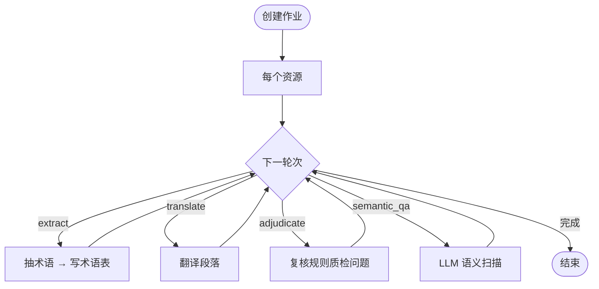

# 流水线与原理

本页说明翻译 **如何执行**：多轮计划、内容保护、响应修复、批量与重试、质量裁决等。偏「为什么 / 内部怎么走」。

::: tip 查字段与界面步骤

- 界面怎么配：[翻译配置 · 使用](/zh/guide/translation-config)
- 字段与默认值：[翻译配置 · 参考](/zh/guide/translation-config-reference)
- CLI 配置文件：[配置文件与环境变量](/zh/guide/configuration)
  :::

## 作业如何跑起来

创建翻译作业时，系统会 **固化** 当前执行计划快照，后台 Worker 按资源依次处理。


```mermaid
flowchart TD
  Start([创建作业]) --> Res[每个资源]
  Res --> Next{下一轮次}
  Next -->|extract| Ex[抽术语 → 写术语表]
  Next -->|translate| Tr[翻译段落]
  Next -->|adjudicate| Ad[复核规则质检问题]
  Next -->|semantic_qa| Sq[LLM 语义扫描]
  Next -->|完成| Done([结束])
  Ex --> Next
  Tr --> Next
  Ad --> Next
  Sq --> Next
```

**翻译轮次内部（简要）：**

1. 内容保护（占位符替换）
2. 组装上下文 → 调用 AI
3. 还原占位符 / 后处理 / 可选 Ruby 还原
4. 规则质检写回段落（含 16 项确定性 checker）

可选：执行配置中的 **内联术语自举** 会在翻译响应中一并抽术语。语义质检产生的 `warning` 级问题通过 `span` 精确定位到译文片段。

推荐轮次顺序：`extract`（可选）→ `translate`（可多轮）→ `adjudicate`（可选）→ `semantic_qa`（可选）。

---

## 多轮翻译：级联回退

多个 **`translate` 轮次** 不是「润色流水线」，而是 **失败回退**：

```text
Round 1：尝试全部待译段落
  ├─ 成功 → 写入，该段结束
  └─ 失败 → 交给 Round 2
Round 2：只处理 Round 1 失败的段落
  └─ …
```

**典型用途：** 主模型失败换备用模型；第二轮更小批次 / 更低并发提高成功率。

提取轮次在翻译前写术语；裁决轮次在规则质检之后做降噪。配置入口见 [翻译配置 · 使用 · 执行计划](/zh/guide/translation-config#执行计划)。

---

## 批量与并发

每轮按 `batch_size`（段落数）与/或 `max_words_per_batch`（字词数）组批，Worker 池并发请求。

- CJK 常按字符计词；非 CJK 常按空白分词
- 批次会带上上下文窗口，保证连贯
- **失败降级**：整批失败时按 `fallback_shrink` 缩小批次（默认约一半）再试，最小可到 1 段
- 仍失败的段落可进入下一翻译轮次

字段表见 [翻译配置 · 参考 · translate](/zh/guide/translation-config-reference#translate)。

---

## 内容保护

翻译前将代码、链接、占位符、HTML 标签等换成 `__LF_000001__` 形式（固定宽度编号），译后还原。

- 默认规则：`code` / `link` / `placeholder` / `xml`
- 相邻占位符可能合并，减少对模型的干扰
- 模型应 **原样保留** 占位符字符串

规则列表见 [翻译配置 · 参考 · protect](/zh/guide/translation-config-reference#内容保护-protect)。

---

## 上下文窗口

为当前段附带前后各 N 段作 **只读参考**（不译）。

- 优先用保护前的原文，便于模型阅读
- `max_chars` > 0 时在句末附近截断
- 跳过空段、纯占位符、装饰分隔线

参数见 [翻译配置 · 参考 · context](/zh/guide/translation-config-reference#上下文-context)。

---

## 响应修复

模型输出不总是合法 JSON。修复链大致包括：

| 级别     | 内容                                             |
| -------- | ------------------------------------------------ |
| 结构     | BOM/控制字符、括号、尾逗号等                     |
| 别名     | `translation` / `result` 等映射到 `translations` |
| 部分结果 | 部分段缺失时只重试缺失段（受阈值控制）           |
| 占位符   | 大小写/下划线变体归一                            |
| 提示升级 | 附加反例 reminder 再请求一次                     |

纯文本模式下还有去围栏、解析 `[glossary]` / `[ruby]` 等逻辑。开关见 [翻译配置 · 参考 · repair](/zh/guide/translation-config-reference#响应修复-repair)。

---

## 术语提取（Bootstrap）

| 模式                                  | 机制                                     |
| ------------------------------------- | ---------------------------------------- |
| **独立提取**（计划 `extract` 或 pre） | 译前单独调用，写术语表，后续翻译轮次共享 |
| **内联**（执行配置 bootstrap）        | 翻译响应中顺带返回术语，省一次调用       |

内联冲突策略：

| 策略                    | 行为                               |
| ----------------------- | ---------------------------------- |
| `rewrite-local`（默认） | 冲突时以术语表权威译法改写本批译文 |
| `off`                   | 先到先得，文档内可能不一致         |

产品操作见 [术语表管理](/zh/guide/glossary)；字段见 [翻译配置 · 参考](/zh/guide/translation-config-reference#术语自举-bootstrap)。

---

## 规则质检与 AI 质量裁决

### 规则质检

翻译轮次内由 QA 引擎同步跑规则检查并写回段落。共 16 项确定性 checker（其中 1 项 `duplicate_source_divergence` 为文档级、跨段比对，不可在 `qa.checks` 中关闭）；其余 15 项 per-batch checker 均可在执行配置 `qa.checks` 中按名选择性启用：

| code                          | 含义                                           | 可否 AI 裁决 |
| ----------------------------- | ---------------------------------------------- | ------------ |
| `length_ratio`                | 过短/过长                                       | ✅ 软规则    |
| `duplicate`                   | 相邻译文完全相同                               | ❌ 硬规则    |
| `duplicate_source_divergence` | 文档级同源异译                                 | ❌ 文档级    |
| `untranslated`                | 译文=原文                                       | ❌ 硬规则    |
| `source_residual`             | 译文夹源语脚本                                 | ✅ 软规则    |
| `punctuation_pairing`         | 标点配对不平衡                                 | ❌ 硬规则    |
| `whitespace_irregular`        | 零宽/NBSP/制表符等异常空白                     | ❌ 硬规则    |
| `repeated_space`              | 连续空格 / CJK 间空格                          | ❌ 硬规则    |
| `width_mix`                   | 全/半角混用                                    | ❌ 硬规则    |
| `number_mismatch`             | 阿拉伯数字集合不一致                           | ❌ 硬规则    |
| `url_email_mismatch`          | URL/邮箱集合不一致                             | ❌ 硬规则    |
| `subtitle_line_count`        | 字幕行数不一致                                 | ❌ 硬规则    |
| `forbidden_term`              | 命中禁译词条却仍出现在译文                     | ❌ 硬规则    |
| `term_inconsistency`          | 命中强制词条但译文未用 target                  | ❌ 硬规则    |
| `leftover_placeholder`        | 译文残留 `__LF_*` 占位符                       | ❌ 硬规则    |
| `xml_tag_mismatch`           | XML 标签集合不一致                             | ❌ 硬规则    |

源语残留按 Unicode 脚本与语言对分档（独立脚本偏严；共汉字语言对有不同策略）。源语言为 `auto` 时残留检测不生效。规则与可裁决性等细节见 [翻译审校 · 质量检测](/zh/guide/review#质量检测)。

### 质量裁决（`adjudicate`）

对软规则问题逐条问 AI：`real` 保留 / `false_positive` 剔除。

1. 只处理已译/已改且带可裁决 code（`source_residual` / `length_ratio`）的段落
2. 分批调用 **内置** 裁决提示词
3. 解析失败时 **保留原问题**，不清空

**建议：** 放在翻译轮次之后；专有名词多的文档优先开 `source_residual`。配置见 [翻译配置 · 使用](/zh/guide/translation-config#进阶组合)；协议细节见 [翻译配置 · 参考 · adjudicate](/zh/guide/translation-config-reference#adjudicate)。

### 语义质检（`semantic_qa`）

用 LLM 扫描已译段落，捕获规则无法覆盖的语义问题（如 `mistranslation` / `calque` / `omission` / `addition` / `grammar` / `register` / `term_fidelity` / `naturalness`）：

1. 系统提示词 **内置**（不可改），内部已显式排除规则负责的 code，不重复报
2. 输出为 `warning` 级问题，带 `span` 精确定位，**直接进人审，不经裁决**
3. 扫描范围可按 `segment_scope` 限定（`all` / `with_issues` / `with_issue_codes`），成本敏感时可只扫高价值子集
4. 扫描失败采用**软警告**：写入资源 `warning_message`，作业继续而非终态失败

::: tip 与裁决的差异
裁决只对已有规则问题做「保留/剔除」，不新增；语义质检则是**新增**语义类问题。二者互补，不冲突。
:::

协议细节见 [翻译配置 · 参考 · semantic_qa](/zh/guide/translation-config-reference#semantic-qa)。审校侧呈现见 [翻译审校 · 质量检测](/zh/guide/review#质量检测)。

---

## Ruby 注音

含 `<ruby>` 的 HTML：

1. **译前** 抽出注音，正文只留 base
2. **译后** 按类型过滤，把标签插回译文
3. 本地对齐失败时，可用计划级 **Ruby 重试** 再调一次 LLM

类型：`phonetic` / `semantic` / `creative`。字段见 [翻译配置 · 参考 · ruby](/zh/guide/translation-config-reference#ruby-ruby)。

---

## 速率限制与重试

### 限速

后端 `rate_limit_per_minute`：令牌桶，超限等待而非丢弃。`0` 表示不限。

### 超时

后端 `timeout`（默认 60 秒）可关闭：关闭后实际请求不设时限，适合本地大模型或慢响应网关。本地超时与父上下文截止区分处理——本地超时按可重试错误退避重试，父上下文截止则跳过重试。

### 错误策略（摘要）

LLM 请求层：

| 场景       | 行为                                         |
| ---------- | -------------------------------------------- |
| 429 / 503  | 退避后重试；尊重 `Retry-After`，常有最小等待 |
| 网络/超时  | 缩小批次再试（本地超时按可重试退避）         |
| 解析失败   | 先提示升级修复，再缩小批次                   |
| 401 / 403  | 不重试，留给后续轮次                         |
| 部分段缺失 | 同轮再组批一次                               |

重试参数：`max_attempts` / `backoff_ms` / `jitter`（指数退避 + 抖动）。见 [翻译配置 · 参考 · 重试](/zh/guide/translation-config-reference#重试-retry)。

#### 持久化层错误分类

每段译文/QA 结果写回数据库时，LinguaFlow 会对底层错误分级（按数据库驱动分别识别 SQLite / PostgreSQL 的错误码），避免把可恢复的瞬时故障当成硬失败：

| 错误性质 | 典型来源 | 行为 |
| --- | --- | --- |
| **结构性错误** | schema 不匹配、字段缺失、约束违反等 | **fail-fast**，整轮中止并上报，避免后续段重复踩坑 |
| **瞬时错误** | 连接断开、锁竞争、临时不可写等 | 跳过本段写回、段保持 `pending`，**留给同作业后续 translate 轮次重试** |
| 正常写入 | — | 正常落库 |

设计要点：

- 每轮 `translate` 开始时重置「瞬态失败段」追踪集合；本轮瞬时失败的段不写最终译文，保留 `pending` 状态供下一轮再次取到
- 这意味着多轮计划里，靠后的 `translate` 轮有机会「兜住」前一轮因数据库瞬时故障漏掉的段，而不是整轮作废
- 该机制对用户透明：你只会在作业日志中看到部分段被标记为重试，无需手动干预

---

## 单段试译预览

正式作业之外，可对单个段直接发起 **试译预览（preview）**：选一个执行计划，对一段原文在内存中完整跑一遍 `extract → translate → adjudicate → semantic_qa`，不创建作业、不持久化中间结果、不污染术语表/翻译记忆。

- **诊断输出**：批次事件携带 `round_index` / `attempt` / `system_prompt` / `user_message` / `response_format` / `json_schema` / `response_content`，用于排查提示词、响应格式与批次问题
- **用量计量**：调用次数与 token 消耗按预览口径统计，与正式作业区分
- **应用译文**：预览结果返回一个带签名的 `apply_token`（有过期时间）；应用时用令牌做基线（source / target / status）条件更新，检测到段落已变化会拒绝，避免覆盖他人改动
- **内存隔离**：术语表用内存 overlay、翻译记忆用 Noop，确保试译的副作用留在沙箱内

### 多轮试译的过滤语义

试译支持多轮执行计划。对 `translate` 轮次，目标段是否纳入遵循如下规则：

| 轮次位置 | 目标段处理 |
| --- | --- |
| **首个 `translate` 轮** | **强制翻译**，无视目标段当前状态——保留「预览即重译」的语义 |
| **后续 `translate` 轮** | 按 [`segment_filter`](/zh/guide/translation-config-reference#translate) 判断：目标段状态符合过滤条件才纳入，否则**跳过本轮**，保留上一轮译文作为后续轮次的上下文 |

`extract` / `adjudicate` / `semantic_qa` 等非 translate 轮次始终处理目标段，其筛选逻辑由各自 handler 按状态自行完成，不受此规则影响。

换句话说：如果你用一个「翻译 → 裁决 → 再翻译」的计划做试译，第二个翻译轮只会处理那些状态仍满足过滤条件（如 `pending`）的目标段，避免对已经被前一轮改写的段无意义重译。

产品操作见 [翻译配置 · 使用 · 单段试译](/zh/guide/translation-config#单段试译)；接口契约见 [翻译配置 · 参考 · 单段试译](/zh/guide/translation-config-reference#单段试译-preview)。

---

## 插件（规划中）

::: warning 尚未实现
计划通过 Lua 脚本挂 `before_translate` / `after_translate` 等钩子。当前仅有接口与配置占位，请勿依赖。
:::

```yaml
plugins:
  enabled: false
  scripts: []
```

---

## 下一步

- [翻译配置 · 使用](/zh/guide/translation-config) · [翻译配置 · 参考](/zh/guide/translation-config-reference)
- [翻译审校](/zh/guide/review)（含语义质检呈现）· [术语表管理](/zh/guide/glossary)
- [常见问题](/zh/guide/faq)
