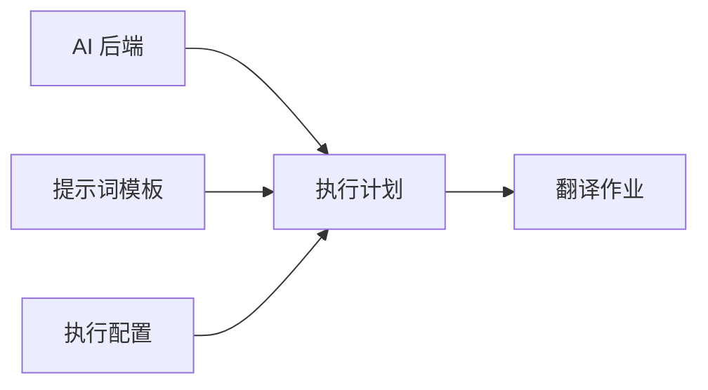

# 翻译配置 · 使用

本页说明 **在 Web 界面里如何配置翻译**：AI 后端、提示词、执行配置与执行计划。以步骤与场景为主。

::: tip 第一次使用？
按 [快速开始 · Web](/zh/guide/getting-started) 建「单轮翻译 + 内置通用提示词/策略」即可。名词见 [核心概念](/zh/guide/concepts)。

字段全集、模板变量、YAML 默认值见 [翻译配置 · 参考](/zh/guide/translation-config-reference)。流水线原理见 [流水线与原理](/zh/guide/pipeline)。
:::

## 四个模块怎么配合

| 模块 | 作用 | 界面入口（约） |
| --- | --- | --- |
| **AI 后端** | 连哪个模型、Key、Base URL | AI 后端 |
| **提示词模板** | 发给模型的指令（翻译 / 术语提取 / 术语精简） | 翻译配置 · 提示词 |
| **执行配置** | 分段、保护、修复、质检、上下文等行为 | 翻译配置 · 执行配置 |
| **执行计划** | 多轮流水线：每轮用哪个后端、何种模式 | 翻译配置 · 执行计划 |

点「翻译」时选的是 **执行计划**；计划引用后端 +（翻译轮次上的）提示词与执行配置。

## AI 后端

### 添加后端

1. 打开 **AI 后端**（或设置中的对应入口）
2. 点击 **添加后端**
3. 选择提供商并填写 API Key 等
4. 保存

| 提供商 | 类型 | 常用默认模型 |
| --- | --- | --- |
| OpenAI | `openai` | `gpt-4o-mini` |
| Anthropic | `anthropic` | `claude-sonnet-4-5` |
| Google Gemini | `google` | `gemini-2.5-flash` |

### 常用选项（界面）

- **API Key**（必填）
- **Model** — 模型名
- **Base URL** — 代理或兼容服务（Azure / Ollama / LM Studio 等）
- **流式请求** — 仅当上游网关要求 `stream:true` 时开启；对外仍是完整响应
- **每分钟限速** — 避免打满 API 配额（`0` 表示不限）

兼容服务示例（OpenAI 类型 + Base URL）：

| 服务 | Base URL 示例 |
| --- | --- |
| Ollama | `http://localhost:11434/v1` |
| LM Studio | `http://localhost:1234/v1` |
| Azure OpenAI | 按资源部署路径填写 |

完整字段表见 [翻译配置 · 参考 · AI 后端](/zh/guide/translation-config-reference#ai-后端)。

::: warning 密钥
Key 存在本地数据库。CLI 场景优先用环境变量（如 `OPENAI_API_KEY`），避免写进可提交的配置文件。
:::

## 提示词模板

### 何时需要自定义

| 情况 | 建议 |
| --- | --- |
| 通用文档 / 字幕 | 直接用内置 **通用提示词** |
| 固定文风、领域口吻、输出约束 | 自建翻译提示词 |
| 术语提取质量不满意 | 自建术语抽取模板 |
| 术语表过大要清理 | 使用术语精简模板（见 [术语表](/zh/guide/glossary)） |

### 创建自定义模板

1. 进入 **提示词模板**
2. 选择类型：翻译 / 术语抽取 / 术语精简
3. **创建模板** → 编辑内容 → 保存
4. 在执行计划对应轮次中选用该模板

内置（`system`）模板不可改删，可复制后改。模板变量与消息协议见 [翻译配置 · 参考 · 提示词](/zh/guide/translation-config-reference#提示词模板)。

## 执行配置

执行配置（Execution Profile）控制「怎么切段、保护什么、如何修响应、是否质检」等。

### 创建与选用

1. 进入 **执行配置** → **创建配置**
2. 从内置 **通用策略** 复制或从零调整
3. 在执行计划的 **翻译轮次** 中引用该配置

### 常见调参场景

| 目标 | 建议调整 |
| --- | --- |
| 代码/链接被误译 | 确认 **内容保护** 开启，规则含 `code` / `link` / `placeholder` / `xml` |
| 长文前后不连贯 | 打开 **上下文窗口**，适当增大 before/after |
| 译文格式经常坏 | 保持 **响应修复** 默认开启 |
| 专业术语要边译边抽 | 开启执行配置中的 **内联术语自举**（或改用计划里的提取轮次） |
| 质检太吵 / 太松 | 调整 **质量检测** 长度比等；误报再用裁决轮次降噪 |

字段说明与默认 YAML 见 [翻译配置 · 参考 · 执行配置](/zh/guide/translation-config-reference#执行配置)。行为原理见 [流水线与原理](/zh/guide/pipeline)。

## 执行计划

执行计划把后端、模板、配置串成 **按顺序执行的轮次**。

### 轮次模式

| 模式 | 做什么 | 典型位置 |
| --- | --- | --- |
| `translate` | 翻译段落 | 至少一轮，可多轮做失败回退 |
| `extract` | 从源文抽术语写入术语表 | 通常在翻译前 |
| `adjudicate` | AI 复核规则质检问题，剔除误报 | 通常在翻译后 |

推荐顺序：`extract`（可选）→ `translate`（可多轮）→ `adjudicate`（可选）。

### 最小计划（上手）

1. **创建计划**，命名如「默认翻译」
2. 添加一轮 **翻译**：
   - 后端 = 你刚配的 AI 后端
   - 提示词 = 内置通用提示词
   - 执行配置 = 内置通用策略
   - 批次 / 并发：先用界面默认；撞限速再降并发
3. 保存，创建作业时选它

### 进阶组合

| 场景 | 计划怎么搭 |
| --- | --- |
| 术语要先建表 | 提取轮次 → 翻译轮次 |
| 主模型常失败 | 翻译轮次 1（主模型）+ 翻译轮次 2（备用模型/更小批次） |
| 源语残留误报多 | 翻译后加 **质量裁决**，勾选 `source_residual`（可选 `length_ratio`） |
| 日文 HTML 注音 | 执行配置开 Ruby；计划可开 Ruby 重试 |

### 创建步骤（完整）

1. **设置 → 执行计划 → 创建计划**
2. （可选）添加 **提取** 轮次并选术语抽取模板
3. 添加至少一轮 **翻译**
4. （可选）添加 **质量裁决**
5. （可选）配置 Ruby 重试
6. 保存

::: info 裁决提示词
质量裁决使用系统内置提示词，**不能**选自定义模板。`untranslated` / `duplicate` 为硬规则，不可裁决。
:::

批次、重试、过滤等字段见 [翻译配置 · 参考 · 执行计划](/zh/guide/translation-config-reference#执行计划)。多轮回退与裁决原理见 [流水线与原理](/zh/guide/pipeline)。

## 术语提取的两种方式

| 方式 | 在哪里开 | 特点 |
| --- | --- | --- |
| **提取轮次** `extract` | 执行计划 | 独立 LLM 调用，适合译前建表 |
| **内联自举** | 执行配置 `bootstrap` | 翻译响应里顺带抽术语，省一次调用 |

操作与同步见 [术语表管理](/zh/guide/glossary)。

## 作用域（多用户时）

| 作用域 | 含义 |
| --- | --- |
| `system` | 内置，只读 |
| `user` | 仅创建者 |
| `org` | 组织共享（依赖服务器模式 · 预览） |

本地模式只需关心自己的 `user` 资源与内置 `system` 模板。

## 最佳实践（短）

1. 先跑通最小计划，再加提取/裁决  
2. 专业内容优先维护 [术语表](/zh/guide/glossary)  
3. 保护规则保持开启，避免代码与占位符被译  
4. 并发与批次按 API 限速与模型上下文调整  
5. 质检误报用裁决降噪，硬规则问题仍人工处理  

## 下一步

- [翻译配置 · 参考](/zh/guide/translation-config-reference) — 字段与模板变量  
- [流水线与原理](/zh/guide/pipeline) — 多轮、保护、修复、裁决如何工作  
- [术语表管理](/zh/guide/glossary) · [翻译审校](/zh/guide/review)  
- CLI 侧配置文件：[配置文件与环境变量](/zh/guide/configuration)
