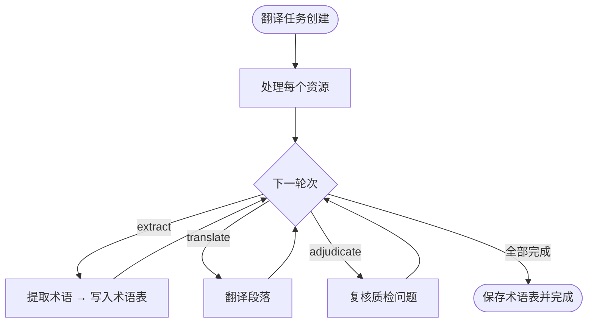

# 翻译配置

LinguaFlow 提供灵活的翻译配置系统，用于控制 AI 后端、提示词、执行策略与多轮计划。

::: tip 第一次使用？
不必先读完整页。按 [快速开始 · Web](/zh/guide/getting-started) 建「单轮翻译 + 内置通用提示词/策略」即可跑通；名词见 [核心概念](/zh/guide/concepts)。
:::

本文档涵盖四个核心配置模块：

| 模块           | 说明                                                                         |
| -------------- | ---------------------------------------------------------------------------- |
| **AI 后端**    | 翻译使用的 AI 服务及其连接参数                                               |
| **提示词模板** | 发送给 AI 的翻译指令（Go template 语法）。三类模板：翻译、术语抽取、术语精简 |
| **执行配置**   | 翻译行为的详细参数（分段、保护、修复、质量检测等）                           |
| **执行计划**   | 将后端、模板、配置组合成模式化多轮流水线（翻译 / 术语提取 / 质量裁决）       |

## AI 后端配置

### 支持的 AI 后端

LinguaFlow 通过工厂注册模式支持以下 AI 后端：

| 后端          | 类型标识    | 默认模型            | 特殊功能                                                    |
| ------------- | ----------- | ------------------- | ----------------------------------------------------------- |
| OpenAI        | `openai`    | `gpt-4o-mini`       | 兼容 Azure OpenAI、Ollama、LM Studio 等 OpenAI API 兼容服务 |
| Anthropic     | `anthropic` | `claude-sonnet-4-5` | 通过 Tool Use 实现结构化输出；支持提示缓存                  |
| Google Gemini | `google`    | `gemini-2.5-flash`  | 通过 ResponseMIMEType 实现结构化输出                        |

### 添加后端

1. 进入 **设置 → AI 后端**
2. 点击 **添加后端**
3. 选择提供商（OpenAI / Anthropic / Google）
4. 填写配置（见下方配置项）
5. 保存

### 配置项

#### 通用选项

所有后端类型共享以下配置项：

| 选项                    | 类型       | 默认值                                     | 说明                                                                      |
| ----------------------- | ---------- | ------------------------------------------ | ------------------------------------------------------------------------- |
| `api_key`               | string     | **必填**                                   | API 密钥，支持 `${ENV_VAR}` 环境变量展开                                  |
| `base_url`              | string     | SDK 默认                                   | 自定义 API 端点 URL（用于代理或兼容服务）                                 |
| `model`                 | string     | 见上表                                     | 模型名称                                                                  |
| `max_tokens`            | int        | OpenAI: 0 (不限制)；Anthropic/Gemini: 8192 | 最大生成 token 数                                                         |
| `timeout`               | int/string | 60 (秒)                                    | 请求超时时间，支持秒数或 Go duration 字符串                               |
| `response_format`       | string     | `json_schema`                              | 响应格式：`json_schema` \| `json_object` \| `text` \| `none`              |
| `temperature`           | float      | API 默认                                   | 采样温度（OpenAI: 0-2, Anthropic: 0-1, Gemini: 0-2）                      |
| `top_p`                 | float      | API 默认                                   | 核采样参数                                                                |
| `stream`                | bool       | `false`                                    | 以流式发起请求并在内部累积为完整响应；适配只接受 `stream:true` 的兼容网关 |
| `rate_limit_per_minute` | int        | 0 (不限速)                                 | 每分钟请求限制                                                            |

::: tip 流式请求
`stream: true` 不会改变对外返回形态（仍为完整响应），仅改变上游请求方式。OpenAI、Anthropic、Google 三类后端均支持。
:::

#### Anthropic 专有选项

| 选项                  | 类型 | 默认值 | 说明                                                                   |
| --------------------- | ---- | ------ | ---------------------------------------------------------------------- |
| `enable_prompt_cache` | bool | `true` | 启用提示缓存，system prompt 标记为 ephemeral 缓存断点以降低 token 消耗 |

#### 代理与兼容服务

通过 `base_url` 可以将 OpenAI 后端指向兼容服务：

| 服务         | base_url 示例                                                    |
| ------------ | ---------------------------------------------------------------- |
| Azure OpenAI | `https://<resource>.openai.azure.com/openai/deployments/<model>` |
| Ollama       | `http://localhost:11434/v1`                                      |
| LM Studio    | `http://localhost:1234/v1`                                       |

::: warning API Key 安全
API Key 存储在本地数据库中，支持 `${ENV_VAR}` 语法引用环境变量。请勿将密钥硬编码在配置文件中。
:::

## 提示词模板

提示词模板定义了发送给 AI 的翻译指令，使用 Go `text/template` 语法渲染。

### 模板类型

LinguaFlow 支持三类提示词模板，分别用于不同阶段：

| 模板类型           | API 路径                        | 用途                         |
| ------------------ | ------------------------------- | ---------------------------- |
| **翻译提示词模板** | `/translation-prompt-templates` | 翻译阶段的 system prompt     |
| **术语抽取模板**   | `/bootstrap-prompt-templates`   | 术语提取阶段的 system prompt |
| **术语精简模板**   | `/prune-prompt-templates`       | 术语精简阶段的 system prompt |

### 内置模板

LinguaFlow 提供内置的默认翻译提示词模板（scope 为 `system`，ID 为 `-1`），适用于大多数翻译场景。内置模板不可修改或删除。

### 自定义模板

您可以创建自定义模板来控制翻译风格：

1. 进入 **设置 → 提示词模板**
2. 选择模板类型（翻译 / 术语抽取 / 术语精简）
3. 点击 **创建模板**
4. 填写模板名称和描述
5. 编辑提示词内容
6. 保存

### 模板变量

#### 翻译提示词可用变量

::: v-pre

| 变量                     | 类型                          | 说明                                                          |
| ------------------------ | ----------------------------- | ------------------------------------------------------------- |
| `{{.SourceLang}}`        | string                        | 源语言，`"auto"` 表示自动检测                                 |
| `{{.TargetLang}}`        | string                        | 目标语言（BCP 47 格式）                                       |
| `{{.Source}}`            | string                        | 单段模式下的源文本                                            |
| `{{.Segments}}`          | []SegmentInput                | 批量模式下的段落列表，每项含 `ID`、`Source`、`Translate` 字段 |
| `{{.Glossary}}`          | []GlossaryEntry               | 术语表条目，每项含 `Source`、`Target`、`Notes` 字段           |
| `{{.TMHints}}`           | []TMHint                      | 翻译记忆命中，每项含 `Source`、`Target`、`Score` 字段         |
| `{{.TextMode}}`          | bool                          | `true` = 纯文本编号格式；`false` = JSON envelope 格式         |
| `{{.StrictSchema}}`      | bool                          | `true` = 后端使用 json_schema 强制输出，模板精简协议描述      |
| `{{.InlineBootstrap}}`   | bool                          | `true` = 在翻译同时内联抽取术语                               |
| `{{.MaxBootstrapTerms}}` | int                           | 内联模式每批返回术语上限                                      |
| `{{.HasRuby}}`           | bool                          | 是否存在 Ruby 注音信息                                        |
| `{{.RubyMode}}`          | string                        | `"json"` \| `"section"` \| `"inline"`                         |
| `{{.RubyAnnotations}}`   | `map[string][]RubyAnnotation` | 段落 ID → 注音列表                                            |

:::

#### 术语抽取模板可用变量

::: v-pre

| 变量              | 类型     | 说明                         |
| ----------------- | -------- | ---------------------------- |
| `{{.SourceLang}}` | string   | 源语言                       |
| `{{.TargetLang}}` | string   | 目标语言                     |
| `{{.MaxTerms}}`   | int      | 本次最多抽取的术语数         |
| `{{.Texts}}`      | []string | 待抽取的源文本段落           |
| `{{.Existing}}`   | []string | 已存在的术语列表（用于去重） |

:::

#### 术语精简模板可用变量

::: v-pre

| 变量            | 类型            | 说明               |
| --------------- | --------------- | ------------------ |
| `{{.Glossary}}` | []GlossaryEntry | 当前术语表全量条目 |

:::

#### 内置函数

| 函数  | 签名                             | 说明                   |
| ----- | -------------------------------- | ---------------------- |
| `mul` | `func(a float32, b int) float64` | 乘法，用于术语密度计算 |

### 用户消息协议

翻译提示词定义了两种用户消息格式：

#### JSON 模式（默认）

```json
{
  "source_lang": "en",
  "target_lang": "zh",
  "segments": {
    "0": { "source": "Hello World", "translate": true },
    "1": { "source": "Context paragraph", "translate": false }
  }
}
```

期望回复：

```json
{ "translations": { "0": "你好世界" } }
```

#### 纯文本模式（TextMode=true）

```plaintext
[0] Hello World
[*] Context paragraph
```

期望回复：

```plaintext
[0] 你好世界
```

### 模板示例

以下是默认翻译提示词模板的核心结构：

```plaintext
你是 LinguaFlow，一个专业的翻译引擎。

{{- if eq .SourceLang "auto"}}
自动检测用户文本的语言，翻译为 {{.TargetLang}}。
{{- else}}
将用户的文本从 {{.SourceLang}} 翻译为 {{.TargetLang}}，非 {{.SourceLang}} 内容保持原样。
{{- end}}

协议与输出规则：
{{- if .TextMode}}
- 用户消息是纯文本格式，带编号的段落需要翻译，[*] 标记的段落是上下文参考。
- 每个需要翻译的段落输出一行，格式为 [编号] 翻译文本。
...
{{- else}}
- 用户消息是一个 JSON 对象，包含 source_lang、target_lang、segments 字段。
- segments 中每个条目包含 "source"（原文）和 "translate"（是否需要翻译）。
- 你的回复必须是一个 JSON 对象，其中 "translations" 仅包含 translate=true 的段落。
...
{{- end}}

翻译规则：
- 保留所有 __LF_NNNNNN__ 形式的占位符原样不变。
- 术语翻译应在所有片段间保持一致。
...
{{- if .Glossary}}
- 术语表（严格遵守）：
{{range .Glossary}}  · {{.Source}} => {{.Target}}{{if .Notes}}  ({{.Notes}}){{end}}
{{end}}{{- end}}
```

::: tip
完整模板内容请参考源码：`backend/internal/templates/default/prompts/default.tmpl`
:::

## 执行配置

执行配置（Execution Profile）控制翻译的详细行为，包括分段、保护、修复、质量检测等参数。

### 创建配置文件

1. 进入 **设置 → 执行配置**
2. 点击 **创建配置**
3. 填写配置名称和描述
4. 调整各项参数
5. 保存

### 执行配置项

#### 分段策略（split）

控制如何将文本分割为翻译段落。

| 字段        | 类型   | 默认值        | 说明                               |
| ----------- | ------ | ------------- | ---------------------------------- |
| `enabled`   | bool   | `true`        | 是否启用分段                       |
| `strategy`  | string | `"paragraph"` | 分段策略（当前仅支持 `paragraph`） |
| `max_chars` | int    | `1200`        | 每段最大字符数                     |

#### 内容保护（protect）

保护不需要翻译的内容，替换为 `__LF_NNNNNN__` 占位符，翻译后自动还原。

| 字段      | 类型     | 默认值                                           | 说明             |
| --------- | -------- | ------------------------------------------------ | ---------------- |
| `enabled` | bool     | `true`                                           | 是否启用内容保护 |
| `rules`   | []string | `&#91;"code", "link", "placeholder", "xml"&#93;` | 保护规则列表     |

可用的保护规则：

| 规则标识      | 说明                                |
| ------------- | ----------------------------------- |
| `code`        | 保护代码块（行内代码和围栏代码块）  |
| `link`        | 保护 URL 和 Markdown 链接           |
| `placeholder` | 保护占位符（如 `\{\{variable\}\}`） |
| `xml`         | 保护 HTML/XML 标签结构              |

#### Ruby 注音（ruby）

控制 HTML `<ruby>` 注音标签的提取与还原。

| 字段             | 类型     | 默认值                                         | 说明                   |
| ---------------- | -------- | ---------------------------------------------- | ---------------------- |
| `enabled`        | bool     | `false`                                        | 是否启用 Ruby 注音处理 |
| `preserve_kinds` | []string | `&#91;"phonetic", "semantic", "creative"&#93;` | 保留的注音分类         |

注音分类说明：

| 分类       | 说明                 | 标注处理       |
| ---------- | -------------------- | -------------- |
| `phonetic` | 音注（纯读音标注）   | 保留原文不翻译 |
| `semantic` | 义训（语义解释标注） | 保留原文不翻译 |
| `creative` | 创意注音（语义落差） | 需要翻译       |

#### 后处理（postprocess）

翻译完成后的文本清理。

| 字段          | 类型 | 默认值 | 说明             |
| ------------- | ---- | ------ | ---------------- |
| `enabled`     | bool | `true` | 是否启用后处理   |
| `trim_spaces` | bool | `true` | 是否裁剪多余空白 |

#### 响应修复（repair）

自动修复 AI 返回的翻译结果中的常见问题。

| 字段                    | 类型  | 默认值 | 说明                                                                                    |
| ----------------------- | ----- | ------ | --------------------------------------------------------------------------------------- |
| `enabled`               | bool  | `true` | 总开关，`false` 时强制关闭所有子项                                                      |
| `json_structural`       | bool  | `true` | JSON 结构修复（BOM 剥离、尾随逗号、括号补齐、控制字符清理）                             |
| `schema_aliases`        | bool  | `true` | schema 别名映射（`translation`/`result`/`output`/`data.translations` → `translations`） |
| `partial`               | bool  | `true` | 部分 ID 缺失时仅重试缺失段，而非整批 shrink                                             |
| `partial_threshold`     | float | `0.5`  | 缺失率 ≥ 此阈值时走 shrink 而非 partial（取值范围 0-1）                                 |
| `placeholder_normalize` | bool  | `true` | 占位符大小写/下划线变体归一化                                                           |
| `prompt_upgrade`        | bool  | `true` | 解析失败或占位符仍缺失时附加反例 reminder 重试一次                                      |

#### 术语自举（glossary.bootstrap）

在翻译过程中自动抽取术语（内联模式）。

| 字段                       | 类型   | 默认值            | 说明                                           |
| -------------------------- | ------ | ----------------- | ---------------------------------------------- |
| `enabled`                  | bool   | `false`           | 是否启用内联自举                               |
| `max_terms_per_1000_chars` | float  | `3.0`             | 每 1000 源文字符最多抽取的术语条数（缩放系数） |
| `min_source_len`           | int    | `2`               | 术语源文最短字符数                             |
| `inline_conflict_strategy` | string | `"rewrite-local"` | 并发术语冲突策略：`off` \| `rewrite-local`     |

#### 质量检测（qa）

翻译完成后自动检测译文中的常见问题。

| 字段                   | 类型   | 默认值   | 说明                             |
| ---------------------- | ------ | -------- | -------------------------------- |
| `enabled`              | bool   | `true`   | 是否启用质量检测                 |
| `length.enabled`       | bool   | `true`   | 长度异常检测（原文与译文长度比） |
| `length.min_ratio`     | float  | `0.5`    | 最小长度比                       |
| `length.max_ratio`     | float  | `2.5`    | 最大长度比                       |
| `length.unit`          | string | `"char"` | 长度计算方式：`char` \| `word`   |
| `repetition.enabled`   | bool   | `true`   | 重复翻译检测                     |
| `untranslated.enabled` | bool   | `true`   | 未翻译检测（译文与原文相同）     |

源语残留（`source_residual`）由质量检测引擎按源/目标语言对自动启用，无需在配置中单独开关。详见 [翻译审校](/zh/guide/review#质量检测)。

#### 上下文窗口（context）

为每个翻译段落添加前后文作为上下文，提高翻译连贯性。

| 字段        | 类型 | 默认值 | 说明                                   |
| ----------- | ---- | ------ | -------------------------------------- |
| `enabled`   | bool | `true` | 是否启用上下文窗口                     |
| `before`    | int  | `1`    | 取前 N 段作为上下文                    |
| `after`     | int  | `1`    | 取后 N 段作为上下文                    |
| `max_chars` | int  | `0`    | 每个上下文段落的字符数上限，`0` 不限制 |

### 默认配置

以下是 LinguaFlow 的默认翻译配置：

```yaml
split:
  enabled: true
  strategy: paragraph
  max_chars: 1200

protect:
  enabled: true
  rules: [code, link, placeholder, xml]

ruby:
  enabled: true
  preserve_kinds: [creative]

postprocess:
  enabled: true
  trim_spaces: true

repair:
  enabled: true
  json_structural: true
  schema_aliases: true
  partial: true
  partial_threshold: 0.5
  placeholder_normalize: true
  prompt_upgrade: true

bootstrap:
  enabled: false
  max_terms_per_1000_chars: 3.0
  min_source_len: 2
  inline_conflict_strategy: "rewrite-local"

qa:
  enabled: true
  length:
    enabled: true
    min_ratio: 0.5
    max_ratio: 2.5
    unit: char
  repetition:
    enabled: true
  untranslated:
    enabled: true

context:
  enabled: true
  before: 1
  after: 1
  max_chars: 0
```

## 执行计划

执行计划（Execution Plan Template）将多个 AI 后端、提示词模板和执行配置组合成模式化多轮翻译流水线。

### 核心概念

| 概念                           | 说明                                                               |
| ------------------------------ | ------------------------------------------------------------------ |
| **轮次（Round）**              | 执行计划的基本单元，按 `rounds` 数组顺序依次执行                   |
| **翻译轮次（translate）**      | 翻译阶段，引用特定的后端 + 提示词模板 + 执行配置                   |
| **提取轮次（extract）**        | 术语提取阶段，引用术语抽取模板，从源文本中提取候选术语并写入术语表 |
| **质量裁决轮次（adjudicate）** | 可选阶段：调用 AI 对规则质检标出的问题逐条复核，剔除误报           |
| **Ruby 重试**                  | 计划级开关：翻译轮次中本地注音还原失败时，用 LLM 做注音对齐重试    |

::: tip 术语提取的两种方式

- **提取轮次（`mode: extract`）**：独立轮次，从源文本批量抽取术语（推荐用于翻译前建表）
- **内联自举（`glossary.bootstrap`）**：在**执行配置**中开启，翻译的同时从 LLM 响应内联抽取术语
  :::

### 使用场景

- **失败重试** — 第一轮翻译失败的段落由后续轮次使用不同模型/配置重试
- **多模型对比** — 使用不同模型翻译，人工选择最佳结果
- **质量保证** — 先跑 `extract` 提取术语，再 `translate` 时自动应用，确保术语一致性
- **术语自举** — 通过提取轮次或执行配置的内联自举，从源文本自动建术语表
- **质检降噪** — 翻译后增加裁决轮次，减少源语残留、长度异常的规则误报

### 创建执行计划

1. 进入 **设置 → 执行计划**
2. 点击 **创建计划**
3. 填写计划名称和描述
4. （可选）添加提取轮次（`extract`）
5. 添加翻译轮次（`translate`，至少一轮）
6. （可选）添加质量裁决轮次（`adjudicate`）
7. （可选）配置 Ruby 重试
8. 保存

### 执行计划配置

#### 轮次配置（Rounds）

每个轮次是一个模式化执行阶段，支持三种模式。轮次按 `rounds` 数组顺序依次执行。

| 字段          | 类型   | 说明                                                      |
| ------------- | ------ | --------------------------------------------------------- |
| `mode`        | string | `translate` / `extract` / `adjudicate`                    |
| `backend_id`  | int    | 引用的后端 ID                                             |
| `concurrency` | int    | 并发数（≥ 1）                                             |
| `translate`   | object | `mode=translate` 时必填（提示词、执行配置、批次、重试等） |
| `extract`     | object | `mode=extract` 时必填（术语抽取模板、批次等）             |
| `adjudicate`  | object | `mode=adjudicate` 时必填（可裁决 code、批次、重试等）     |

**提取轮次（extract）主要字段：**

| 字段                       | 类型   | 默认值 | 说明                                             |
| -------------------------- | ------ | ------ | ------------------------------------------------ |
| `template_id`              | int    | —      | 术语抽取提示词模板 ID（BootstrapPromptTemplate） |
| `batch_size`               | int    | `20`   | 每批段落数上限；`0` 不限制                       |
| `max_words_per_batch`      | int    | —      | 每批字词数上限；`0` 不限制                       |
| `max_terms_per_1000_chars` | float  | `25.0` | 每 1000 字词的术语抽取上限系数                   |
| `min_source_len`           | int    | `2`    | 术语源文最短字符数                               |
| `retry`                    | object | —      | 重试配置                                         |

提取轮次只写入术语表，**不修改**段落译文。同一任务内后续翻译轮次会共享已抽取的术语。

**翻译轮次（translate）主要字段：**

| 字段                  | 类型   | 说明                                                     |
| --------------------- | ------ | -------------------------------------------------------- |
| `prompt_template_id`  | int    | 翻译提示词模板 ID                                        |
| `profile_id`          | int    | 执行配置 ID                                              |
| `batch_size`          | int    | 每批段落数上限，`0` 不限制                               |
| `max_words_per_batch` | int    | 每批字词数上限，`0` 不限制                               |
| `fallback_shrink`     | float  | 整批失败时的缩放因子 (0, 1)                              |
| `segment_filter`      | object | 段落状态过滤（`pending_only` / `skip_approved` / `all`） |
| `retry`               | object | 重试配置（见下方）                                       |

**质量裁决轮次（adjudicate）主要字段：**

| 字段                  | 类型     | 默认值                | 说明                                                  |
| --------------------- | -------- | --------------------- | ----------------------------------------------------- |
| `batch_size`          | int      | —                     | 每批段落数上限；与 `max_words_per_batch` 至少填一项   |
| `max_words_per_batch` | int      | —                     | 每批字词数上限                                        |
| `adjudicate_codes`    | []string | `["source_residual"]` | 可裁决的问题 code：`source_residual` / `length_ratio` |
| `retry`               | object   | —                     | 重试配置                                              |

::: info 裁决提示词内置
`adjudicate` 模式的 system prompt 由系统内置，**无需**、也**不能**选择提示词模板。`untranslated` 与 `duplicate` 为硬规则，不可纳入 `adjudicate_codes`。
:::

::: warning 批次限制
翻译 / 提取 / 裁决轮次中，`batch_size` 和 `max_words_per_batch` 至少填一项（不能同时为 0）。提取轮次两者均为 0 时表示不分批、一次发送全部源文。
:::

#### 重试配置（Retry）

| 字段           | 类型 | 默认值 | 说明             |
| -------------- | ---- | ------ | ---------------- |
| `max_attempts` | int  | `3`    | 最大重试次数     |
| `backoff_ms`   | int  | `2000` | 重试间隔（毫秒） |
| `jitter`       | bool | `true` | 是否添加随机抖动 |

#### Ruby 重试配置

启用后，翻译轮次在处理段落时若本地 Ruby 注音还原失败或仅部分对齐成功，会调用 LLM 做注音对齐重试。

| 字段         | 类型 | 默认值  | 说明                                        |
| ------------ | ---- | ------- | ------------------------------------------- |
| `enabled`    | bool | `false` | 是否启用注音对齐重试                        |
| `backend_id` | int  | `0`     | 注音对齐使用的后端 ID；`0` 时使用翻译主后端 |

### 执行流程

翻译任务创建时会固化执行计划快照，Worker 对每个待翻译资源按 `rounds` 顺序依次执行各轮次。



**翻译轮次内部（简要）：** 内容保护 → 带上下文调用 AI → 还原占位符 / 后处理 → 规则质检并落库。若开启 Ruby，会在还原注音时按需做 LLM 对齐重试；若开启执行配置中的内联术语自举，会在翻译响应中一并抽取术语。

推荐顺序：`extract`（可选）→ `translate`（可多轮）→ `adjudicate`（可选）。

## 作用域与权限

所有配置资源（后端、提示词模板、翻译配置、执行计划）都支持三种作用域：

| 作用域   | 说明     | 可见性                      |
| -------- | -------- | --------------------------- |
| `system` | 系统内置 | 所有用户可见，不可修改/删除 |
| `user`   | 用户私有 | 仅创建者可见                |
| `org`    | 组织共享 | 组织内所有成员可见          |

::: info 内置资源
LinguaFlow 提供的默认提示词模板和执行配置使用 `system` 作用域，用户不可修改或删除，但可以基于它们创建自定义副本。
:::

## 最佳实践

::: tip 翻译质量优化建议

1. **使用术语表** — 确保专业术语翻译一致，可通过提取轮次 / 内联自举自动抽取或手动添加
2. **配置内容保护** — 避免代码块、链接和占位符被翻译
3. **启用上下文窗口** — 提高翻译连贯性，尤其适合长文档
4. **选择合适的模型** — 根据语言对和内容类型选择最佳模型
5. **启用响应修复** — 自动处理 AI 返回的常见格式问题
6. **配置多轮重试** — 为关键内容配置多个轮次，使用不同模型/配置提高成功率
7. **质量裁决降噪** — 在翻译后增加 `adjudicate` 轮次，减少源语残留等误报

:::

## 下一步

- 阅读 [术语表管理](/zh/guide/glossary) 了解术语管理
- 阅读 [高级功能](/zh/guide/advanced) 了解更多高级配置
