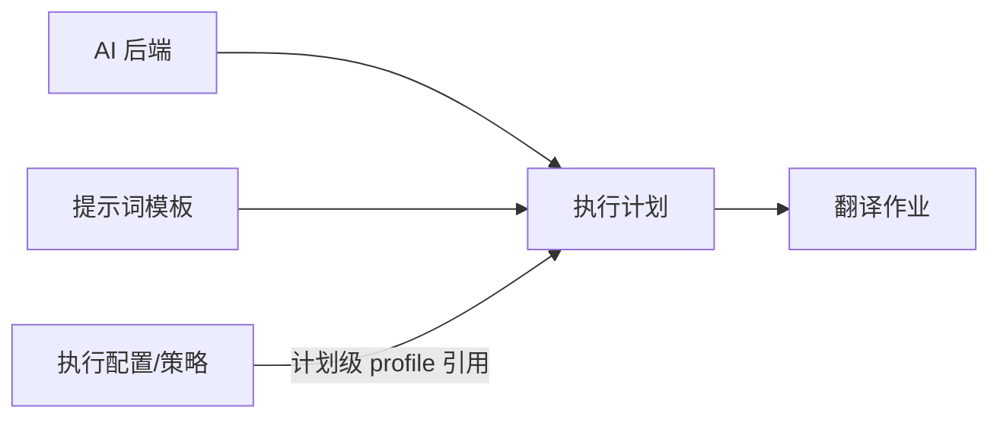

# 翻译配置 · 使用

本页说明 **在 Web 界面里如何配置翻译**：AI 后端、提示词、执行配置与执行计划。以步骤与场景为主。

::: tip 第一次使用？
按 [快速开始 · Web](/zh/guide/getting-started) 建「单轮翻译 + 内置通用提示词/策略」即可。名词见 [核心概念](/zh/guide/concepts)。

字段全集、模板变量、YAML 默认值见 [翻译配置 · 参考](/zh/guide/translation-config-reference)。流水线原理见 [流水线与原理](/zh/guide/pipeline)。
:::

## 四个模块怎么配合

| 模块           | 作用                                         | 界面入口（约）      |
| -------------- | -------------------------------------------- | ------------------- |
| **AI 后端**    | 连哪个模型、Key、Base URL                    | AI 后端             |
| **提示词模板** | 发给模型的指令（翻译 / 术语提取 / 术语精简） | 翻译配置 · 提示词   |
| **执行配置**   | 分段、保护、修复、质检、上下文等行为         | 翻译配置 · 执行配置 |
| **执行计划**   | 多轮流水线：每轮用哪个后端、何种模式         | 翻译配置 · 执行计划 |

点「翻译」时选的是 **执行计划**；计划在顶层引用后端 + 提示词 + 执行配置（策略），translate / revise 轮共享同一份执行配置。

```mermaid
flowchart LR
  B[AI 后端] --> P[执行计划]
  T[提示词模板] --> P
  E[执行配置/策略] -->|计划级 profile 引用| P
  P --> J[翻译作业]
```

## AI 后端

### 添加后端

1. 打开 **AI 后端**（或设置中的对应入口）
2. 点击 **添加后端**
3. 选择提供商并填写 **API Key**（必填）
4. 填写 **模型**（必填）：可点 **探测模型**，用当前 Key / Base URL 向服务商拉取列表后选择；也可手动输入模型 ID
5. 按需调整 Base URL、思考强度、限速等 → 保存

| 提供商        | 类型        | 示例模型（须自行填写） |
| ------------- | ----------- | ---------------------- |
| OpenAI        | `openai`    | `gpt-4o-mini`          |
| Anthropic     | `anthropic` | `claude-sonnet-4-5`    |
| Google Gemini | `google`    | `gemini-2.5-flash`     |

### 常用选项（界面）

- **API Key**（必填）
- **Model**（必填）— 实际可用的模型 ID；推荐先 **探测模型** 再选
- **Base URL** — 代理或兼容服务（Azure / Ollama / LM Studio 等）
- **思考强度** — `关闭` / 低 / 中 / 高；`关闭` 表示不传思考参数、沿用模型默认。仅对支持推理的模型有意义
- **流式请求** — 仅当上游网关要求 `stream:true` 时开启；对外仍是完整响应
- **每分钟限速** — 避免打满 API 配额（`0` 表示不限）
- **超时** — 默认 60 秒；可关闭（关闭后请求不设时限，适合本地大模型或慢响应网关）

::: tip Anthropic 与思考
开启思考后界面会忽略 Temperature / Top P；思考预算与最终输出共用 **Max Tokens**（约 low 25% / medium 50% / high 75% 给思考），批量翻译时建议适当提高 Max Tokens。
:::

兼容服务示例（OpenAI 类型 + Base URL）：

| 服务         | Base URL 示例               |
| ------------ | --------------------------- |
| Ollama       | `http://localhost:11434/v1` |
| LM Studio    | `http://localhost:1234/v1`  |
| Azure OpenAI | 按资源部署路径填写          |

完整字段表见 [翻译配置 · 参考 · AI 后端](/zh/guide/translation-config-reference#ai-后端)。

::: warning 密钥
Key 存在本地数据库。探测模型时凭据仅用于当次请求、不落库。CLI 场景优先用环境变量（如 `OPENAI_API_KEY`），避免写进可提交的配置文件。
:::

## 提示词模板

### 何时需要自定义

| 情况                         | 建议                                                |
| ---------------------------- | --------------------------------------------------- |
| 通用文档 / 字幕              | 直接用内置 **通用提示词**                           |
| 固定文风、领域口吻、输出约束 | 自建翻译提示词                                      |
| 术语提取质量不满意           | 自建术语抽取模板                                    |
| 术语表过大要清理             | 使用术语精简模板（见 [术语表](/zh/guide/glossary)） |

### 创建自定义模板

1. 进入 **提示词模板**
2. 选择类型：翻译 / 术语抽取 / 术语精简
3. **创建模板** → 编辑内容 → 保存
4. 在执行计划对应轮次中选用该模板

内置（`system`）模板不可改删，可复制后改。模板变量与消息协议见 [翻译配置 · 参考 · 提示词](/zh/guide/translation-config-reference#提示词模板)。

## 执行配置

执行配置（Execution Profile）控制「怎么切段、保护什么、如何修响应、是否质检」等。

### 创建与选用

1. 进入 **执行配置** → **创建配置**
2. 从内置 **通用策略** 复制或从零调整
3. 在执行计划的 **顶层「执行策略」下拉** 里引用该配置（计划级 `profile_id`，translate 与 revise 轮共用其 protect/ruby/repair/QA 等行为预设）

### 常见调参场景

| 目标               | 建议调整                                                               |
| ------------------ | ---------------------------------------------------------------------- |
| 代码/链接被误译    | 确认 **内容保护** 开启，规则含 `code` / `link` / `placeholder` / `xml` |
| 长文前后不连贯     | 打开 **上下文窗口**，适当增大 before/after                             |
| 译文格式经常坏     | 保持 **响应修复** 默认开启                                             |
| 专业术语要边译边抽 | 开启执行配置中的 **内联术语自举**（或改用计划里的提取轮次）            |
| 质检太吵 / 太松    | 调整 **质量检测** 长度比等；误报再用裁决轮次降噪                       |
| 只想查特定几项     | 在 **质量检测** 切到「自定义选择」，勾选需要的检查项                   |

字段说明与默认 YAML 见 [翻译配置 · 参考 · 执行配置](/zh/guide/translation-config-reference#执行配置)。行为原理见 [流水线与原理](/zh/guide/pipeline)。

## 语义质检

语义质检是执行计划里的一类轮次，让 LLM 扫描已译段落、找出规则 Qi 难以捕获的语义错误（逐字直译、漏译、增译、语法错误、语体错位等），结果以 `warning` 写回段落并直接进人审。

何时加这一轮：

| 场景                         | 是否值得加                                           |
| ---------------------------- | ---------------------------------------------------- |
| 高价值、人审成本高的文档     | ✅ 建议加，配合扫描范围限定成本                       |
| 大量短文本、追求速度         | ⚠️ 成本与延迟上升，可只扫 `with_issues` 子集          |
| 已用裁决剔除误报             | ✅ 可叠加；语义质检产出的是**新**问题，不与裁决冲突   |

::: warning 不做裁决降噪
语义质检本轮直接进人审，没有裁决轮次兜底。prompt 内部已排除规则负责的 code，避免重复；为减少误报请只标明确问题（内置 prompt 已据此约束）。
:::

扫描范围（`segment_scope`）与可选项见 [翻译配置 · 参考 · semantic_qa](/zh/guide/translation-config-reference#semantic-qa)；问题呈现与筛选见 [翻译审校 · 质量检测](/zh/guide/review#质量检测)。

## 单段试译

在工作区段落行点 **单段试译**，可以选定一个执行计划对**单段**原文先跑一遍流水线看效果，再决定要不要应用：

1. 打开 **单段试译** 抽屉
2. 选择执行计划（必须含至少一个 `translate` 轮次）
3. （可选）填入修改后的原文，模拟「原文变更后再译」
4. 点击 **开始试译**，等待返回译文、质量问题与各轮执行摘要
5. 在 **诊断详情** 中查看每批次的 system prompt / user message / 响应内容 / token 用量
6. 满意后点 **应用译文**，把译文（可先编辑）写回段落

::: warning 试译不污染数据
试译在内存沙箱中执行：术语表用临时覆盖层、翻译记忆不写。只有你显式 **应用译文** 才会持久化到段落。应用令牌会过期，过期需重新试译；若段落内容/状态已被改动，旧令牌会失效。
:::

试译的并发与令牌有效期由后台预览配置控制；若提示「并发已满」，稍后重试即可。原理见 [流水线与原理 · 单段试译预览](/zh/guide/pipeline#单段试译预览)。

::: tip 多轮计划的过滤语义
计划含**多个 `translate` 轮**时：首轮强制翻译目标段；后续翻译轮按 `segment_filter` 判断——目标段状态不符合过滤条件会**跳过**，沿用上一轮译文作为上下文。详见 [流水线与原理 · 多轮试译的过滤语义](/zh/guide/pipeline#多轮试译的过滤语义)。
:::

::: tip 试译 vs 即时翻译
两者都「单段、复用执行计划」，差别在 **是否有段落可挂**：

|                 | 单段试译                       | [即时翻译](/zh/guide/quick-translate)            |
| --------------- | ------------------------------ | ------------------------------------------------ |
| 输入            | 已存在的项目段落原文           | 任意粘贴文本                                     |
| 术语来源        | 项目术语表（临时覆盖层）       | 内联术语表 + 可选项目术语表                      |
| 写回            | 可「应用译文」写回段落         | 不写回任何数据                                   |
| 入口            | 工作区 · 段落行                | 首页 / 工具 · 即时翻译                           |

要试某段已有译文的效果，用 **单段试译**；只想随手译一段文字，用 **即时翻译**。
:::

## 单段修订预览

与单段试译并列的另一类单段预览：不重译原文，而是以段落上 `pending` 的语义问题（误译、仿译、漏译等）为修复目标，对**现有译文**做最小改动的定点修订。

1. 在段落行操作菜单点 **修订预览**（段落须已翻译/已修改、译文非空，且有至少一条 `pending` 语义 issue）
2. 选择执行计划（须含 `revise` 轮；只有 `translate` 轮时后端合成默认修订轮），可选收窄要修复的语义 issue 范围
3. 发起修订，在抽屉里对比原文、原译文、修订后译文，查看修复目标、最终质量问题与用量摘要
4. 满意后点 **应用** 写回（短期签名令牌；段落基线变化或令牌过期需重新预览）

::: tip 试译 vs 修订
| | 单段试译 | 单段修订预览 |
| --- | --- | --- |
| 起点 | 段落原文 | 段落已有译文 |
| 做什么 | 对原文重跑流水线出全新译文 | 对现有译文按 `pending` 语义 issue 做定点最小修订 |
| 适计划 | 须含 `translate` 轮 | 须含 `revise` 轮（或 `translate` 轮，后端合成默认修订轮） |
| 前置 | 段落有原文 | 段落译文非空、有 `pending` 语义 issue |
| 应用 | 同一 `apply` 端点、令牌内 kind 区分 | 同一 `apply` 端点、令牌内 kind 区分 |

两者共用并发限制与应用端点，诊断详情也一致。
:::

## 执行计划

执行计划把后端、模板、配置串成 **按顺序执行的轮次**。

### 轮次模式

| 模式           | 做什么                                       | 典型位置                   |
| -------------- | -------------------------------------------- | -------------------------- |
| `translate`    | 翻译段落                                     | 至少一轮，可多轮做失败回退 |
| `extract`      | 从源文抽术语写入术语表                       | 通常在翻译前               |
| `adjudicate`   | AI 复核规则质检的软规则问题，剔除误报         | 通常在翻译后               |
| `correct`      | 本地机械改写译文，消除规则质检报出的高频安全问题（不调 LLM） | 通常在翻译后               |
| `revise`       | LLM 对现有译文按 `pending` 语义问题做定点最小修订（系统提示词内置） | 通常在翻译后               |
| `semantic_qa`  | LLM 语义扫描，捕获规则查不出的语义错误       | 通常在翻译后（可选）       |

推荐顺序：`extract`（可选）→ `translate`（可多轮）→ `correct`（可选）→ `adjudicate`（可选）→ `revise`（可选）→ `semantic_qa`（可选）。

### 最小计划（上手）

1. **创建计划**，命名如「默认翻译」，在顶层「执行策略」选下拉一份执行配置（内置「通用策略」）
2. 添加一轮 **翻译**：
   - 后端 = 你刚配的 AI 后端
   - 提示词 = 内置通用提示词
   - 批次 / 并发：先用界面默认；撞限速再降并发
3. 保存，创建作业时选它

### 进阶组合

| 场景               | 计划怎么搭                                                                     |
| ------------------ | ------------------------------------------------------------------------------ |
| 术语要先建表       | 提取轮次 → 翻译轮次                                                            |
| 主模型常失败       | 翻译轮次 1（主模型）+ 翻译轮次 2（备用模型/更小批次）                         |
| 源语残留误报多     | 翻译后加 **质量裁决**，勾选 `source_residual`（可选 `length_ratio`）          |
| 译文丢引号等可修复 | 翻译后加 **本地改写**，勾选 `punctuation_missing_wrap` / `punctuation_wrap_loss_wrap` 等规则自动改写译文 |
| 语义问题定点修订   | 翻译/语义质检后加 **LLM 修订**，按 `with_issues` 或 `with_issue_codes` 限定对现有译文做最小改动；或用 [单段修订预览](#单段修订预览) 先看效果 |
| 规则查不出语义错误 | 翻译后加 **语义质检**，按需限定扫描范围（`all` / `with_issues` / `按 code`） |
| 日文 HTML 注音     | 执行配置开 Ruby；计划可开 Ruby 重试                                            |

裁决与语义质检可以叠加使用：裁决只对已有规则问题做「保留/剔除」，语义质检则会**新增**语义类问题，二者不冲突。本地改写与 LLM 修订都直接改写译文以**消除**已报出的问题（改写后重跑确定性 QA 验证，改不掉就回滚保留原问题）——前者纯本地、修高频安全问题，后者调 LLM、按语义问题定点最小修订，可与裁决、语义质检共存。

### 创建步骤（完整）

1. **设置 → 执行计划 → 创建计划**，在顶层「执行策略」下拉选一份执行配置
2. （可选）添加 **提取** 轮次并选术语抽取模板
3. 添加至少一轮 **翻译**
4. （可选）添加 **本地改写**（`correct`），勾选要启用的改写规则
5. （可选）添加 **质量裁决**
6. （可选）添加 **LLM 修订**（`revise`），按需限定扫描范围（`with_issues` / `with_issue_codes` + `issue_codes`）
7. （可选）添加 **语义质检**
8. （可选）配置 Ruby 重试（含最大重试轮数）
9. 保存

::: info 内置提示词
质量裁决、LLM 修订与语义质检均使用系统内置提示词，**不能**选自定义模板。`untranslated` / `duplicate` 为硬规则，不可裁决。本地改写不调 LLM，无需提示词与后端。
:::

批次、重试、过滤等字段见 [翻译配置 · 参考 · 执行计划](/zh/guide/translation-config-reference#执行计划)。多轮回退与裁决原理见 [流水线与原理](/zh/guide/pipeline)。

## 术语提取的两种方式

| 方式                   | 在哪里开             | 特点                             |
| ---------------------- | -------------------- | -------------------------------- |
| **提取轮次** `extract` | 执行计划             | 独立 LLM 调用，适合译前建表      |
| **内联自举**           | 执行配置 `bootstrap` | 翻译响应里顺带抽术语，省一次调用 |

操作与同步见 [术语表管理](/zh/guide/glossary)。

## 作用域（多用户时）

| 作用域   | 含义                              |
| -------- | --------------------------------- |
| `system` | 内置，只读                        |
| `user`   | 仅创建者                          |
| `org`    | 组织共享（依赖服务器模式 · 预览） |

本地模式只需关心自己的 `user` 资源与内置 `system` 模板。

## 最佳实践（短）

1. 先跑通最小计划，再加提取/裁决
2. 专业内容优先维护 [术语表](/zh/guide/glossary)
3. 保护规则保持开启，避免代码与占位符被译
4. 并发与批次按 API 限速与模型上下文调整
5. 质检误报用裁决降噪，硬规则问题仍人工处理

## 下一步

- [翻译配置 · 参考](/zh/guide/translation-config-reference) — 字段与模板变量
- [流水线与原理](/zh/guide/pipeline) — 多轮、保护、修复、裁决、语义质检如何工作
- [术语表管理](/zh/guide/glossary) · [翻译审校](/zh/guide/review)
- CLI 侧配置文件：[配置文件与环境变量](/zh/guide/configuration)
