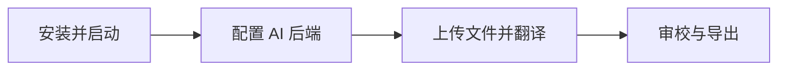

## 适合做什么

| 场景 | 你能得到 |
| --- | --- |
| **文档站 / README** | 整目录 Markdown 批量译成多语言，格式与代码块尽量保持原样 |
| **字幕** | SRT / VTT / ASS 保留时间码，专注译文本 |
| **电子书** | EPUB 按章节浏览与翻译，导出仍是 EPUB |
| **配置与 i18n** | JSON / YAML / TOML 按字符串叶子节点翻译，结构路径可回写 |
| **Word 文稿** | DOCX 解析主文档段落，便于校对与导出 |

## 三步开始



1. **安装并启动** — 下载预编译二进制并运行（推荐），或使用 Docker  
2. **配置 AI 后端** — 填入 API Key，创建一份最简执行计划  
3. **上传并翻译** — 建项目、拖入文件、开始作业，在段落页审校  

详细步骤见 [快速开始 · Web](/zh/guide/getting-started)。若你更习惯终端，见 [快速开始 · CLI](/zh/guide/cli-quickstart)。

## 一行安装

::: code-group

```bash [预编译二进制（推荐）]
# 从 Releases 下载后：
# https://github.com/MeowSalty/LinguaFlow/releases
./linguaflow          # Linux / macOS，自动打开浏览器
# 或双击 linguaflow.exe（Windows）
# 默认：本地模式 http://127.0.0.1:18080
```

```bash [Docker]
docker pull ghcr.io/meowsalty/linguaflow:latest
docker run -p 8080:8080 ghcr.io/meowsalty/linguaflow:latest
# 访问 http://localhost:8080（容器默认服务器模式，见安装文档）
```

```bash [CLI 直接翻译]
linguaflow init
# 编辑 linguaflow.yaml，填入 API Key
linguaflow translate -i README.md -o README_zh.md --to zh
```

:::

## 为什么是 LinguaFlow

- **工作台，而不只是一次对话** — 项目、资源、作业、术语、审校状态可沉淀，适合反复迭代的本地化任务  
- **格式感知** — 不是整文件糊进聊天窗口，而是按文档结构切段、保护不可译内容、再精准回写  
- **可编排** — 执行计划支持翻译、术语提取、质量裁决等多轮流水线，按场景组合  
- **开源可自托管** — AGPL v3；个人与本地场景以单二进制 + SQLite 为主路径  

## 接下来

| 想了解… | 去这里 |
| --- | --- |
| 5 分钟跑通第一次翻译 | [快速开始 · Web](/zh/guide/getting-started) |
| 终端批量翻译 | [快速开始 · CLI](/zh/guide/cli-quickstart) |
| 项目 / 作业 / 执行计划是什么 | [核心概念](/zh/guide/concepts) |
| 安装方式与部署 | [安装部署](/zh/guide/installation) |
| 完整命令与配置项 | [CLI 命令参考](/zh/guide/cli) · [配置文件与环境变量](/zh/guide/configuration) |
| 接口集成 | [API 概述](/zh/api/) |

::: tip 推荐使用路径
个人使用请优先 **预编译二进制 + 本地模式**（端口 `18080`，免登录）。Docker 与服务器模式的差异见 [安装部署](/zh/guide/installation) 与 [使用模式](/zh/guide/modes)。
:::
